# HR портал B2B / B2C / Copay Allsports

  <a class="doc-download-link" href="_assets/documents/company-panel-user-guide-b2b-b2c-copay.docx">Скачать исходный DOCX</a>

  

  

    
Руководство пользователя

    
Allsports Documentation

  

  
Инструкция по работе с HR порталом Allsports для сценариев B2B, B2C и Copay: от входа в систему до управления сотрудниками, заявками и документами.

  

    

      
Для кого

      
HR-менеджеры и представители компаний

    

    

      
Модели работы

      
B2B, B2C и Copay

    

    

      
Основные разделы

      
Сотрудники, подписки, счета, акты, аудит

    

  

## 1. О системе Allsports и Панели компании

Allsports — крупнейший корпоративный спортивный абонемент Беларуси. Более 700 спортивных объектов и 100+ видов активностей по всей стране: фитнес-клубы, бассейны, теннисные корты, единоборства, танцы, СПА и многое другое.

HR портал B2B / B2C / Copay — это веб-инструмент для HR-менеджера компании, подключённой к сервису Allsports. Через него вы управляете подписками сотрудников, просматриваете статистику, работаете со счетами и актами.

Пройдите на https://www.allsports.by/ru-by/companies на вкладку «Компаниям» и нажмите кнопку Получить предложение.

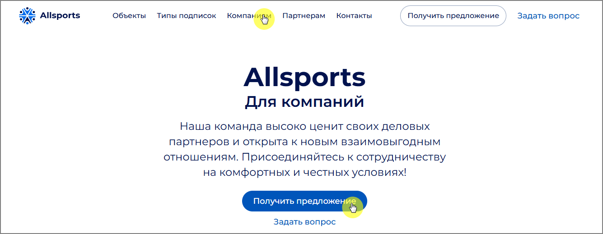

В открывшейся форме заполните поля и нажмите кнопку Отправить.

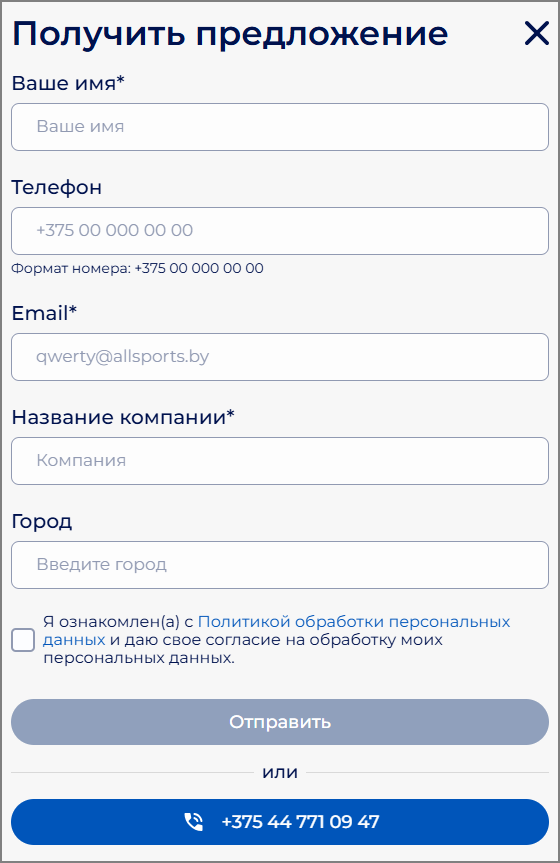

Либо позвоните по телефону +375(44)771-09-47 и вас проконсультирует менеджер по работе с юридическими лицами.

### 1.1. Модели работы компаний

B2B — компания полностью оплачивает подписку своих сотрудников. HR-менеджер сам формирует список сотрудников-подписчиков каждый месяц через HR портал B2B / B2C / Copay. Сотрудники не выполняют никаких действий для подключения.

Copay (соплатёж) — стоимость подписки делится между компанией и сотрудником. Компания определяет, какую часть она берёт на себя, а сотрудник доплачивает остаток самостоятельно. Подключение происходит по персональной ссылке: HR-менеджер направляет её сотруднику, тот сам регистрируется и оплачивает свою долю.

B2C — аналогично Copay по механике: у компании есть ссылка для регистрации, сотрудник сам регистрируется, HR-менеджер подтверждает запрос. Компания полностью или частично покрывает стоимость, но управление идёт через модель самостоятельной регистрации.

Один HR портал B2B / B2C / Copay может содержать несколько компаний разных типов, если юридически они оформлены отдельно.

Ниже приведена сводная таблица ключевых отличий трёх моделей работы компаний в системе Allsports.

#### Кто добавляет сотрудников:

1. B2B: HR-менеджер вручную или через импорт Excel

2. Copay/B2C: Сотрудник самостоятельно по ссылке

#### Роль HR-менеджера:

1. B2B: Формирует список, задаёт уровни подписки, обновляет ежемесячно

2. Copay/B2C: Предоставляет ссылку сотрудникам, подтверждает или отклоняет заявки

#### Оплата подписки:

1. B2B: Компания платит полностью за всех сотрудников в списке

2. Copay: Оплата делится: компания платит часть, сотрудник — остаток

3. B2C: Компания оплачивает полностью или частично, но через механизм самостоятельной регистрации

#### Разделы меню:

1. B2B: Сотрудники, Счета, Акты, Аудит

2. Copay/B2C: Ссылка для регистрации, Активные подписки, Запросы для подтверждения, Отменённые, Счета, Акты, Аудит

#### Статистика (Engagement Report):

1. B2B: Доступна (при активации менеджером Allsports)

2. Copay/B2C: Не предусмотрена

## 2. Вход в HR портал B2B / B2C / Copay

Откройте браузер и перейдите по ссылке https://portal.allsports.by/login. Введите номер мобильного телефона (в формате 375291234567, без пробелов и иных символов), использованного при регистрации компании в системе Allsports. Ознакомьтесь с Политикой конфиденциальности и проставьте отметку в чекбоксе согласия. Нажмите кнопку Войти.

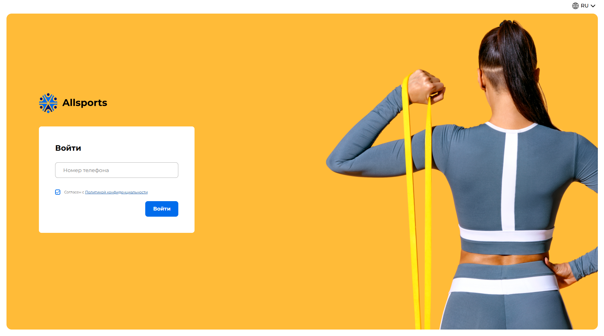

*Рисунок 1 – Страница авторизации*

Далее введите СМС-код, который придет на этот номер. Нажмите кнопку Войти. При необходимости запросите СМС повторно.

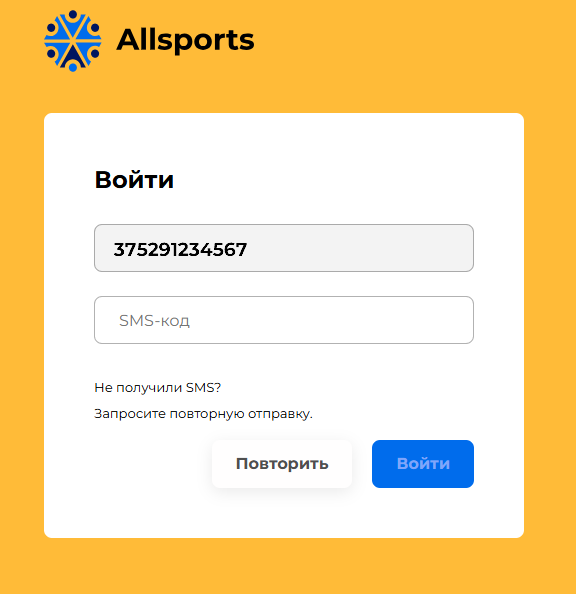

*Рисунок 2 – Ввод СМС-кода*

Поддерживаемые браузеры: Google Chrome, Mozilla Firefox, Microsoft Edge, Safari. Рекомендуется использовать актуальные версии.

## 3. Навигация по HR порталу B2B / B2C / Copay

После входа в левой части экрана отображается меню со списком всех компаний, к которым у вас есть доступ. Каждая компания раскрывается в список разделов. В верхней части меню расположено поле поиска — оно позволяет быстро найти нужную компанию в списке.

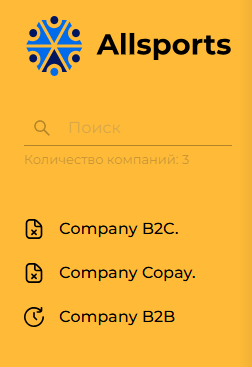

*Рисунок 3 — Боковое меню Панели компании — три типа компаний*

Разделы меню зависят от типа компании:

#### Разделы B2B-компании:

1. Сотрудники — список сотрудников-подписчиков, управление ежемесячным списком

2. Счета — счета на оплату

3. Акты — закрывающие акты

4. Аудит — журнал изменений

#### Разделы Copay/B2C-компании:

1. Ссылка для регистрации пользователей — персональная ссылка, которую вы направляете сотрудникам

2. Активные подписки — сотрудники с действующей подпиской

3. Запросы для подтверждения — новые заявки от сотрудников, ожидающие вашего одобрения

4. Отменённые — сотрудники, отменившие подписку

5. Счета — счета на оплату

6. Акты — закрывающие акты

7. Аудит — журнал изменений

## 4. Работа с B2B-компанией

В модели B2B HR-менеджер полностью контролирует список подписчиков: самостоятельно добавляет сотрудников, задаёт уровни подписки и обновляет список каждый месяц. Сотрудники не совершают никаких действий — после добавления в список они получают доступ к мобильному приложению.

### 4.1. Раздел «Сотрудники». Инструкция при входе

При первом входе система отображает всплывающее окно с инструкцией по работе с панелью.

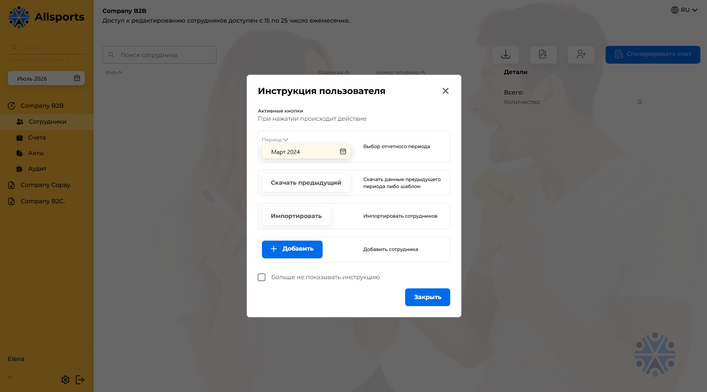

*Рисунок 4 — Всплывающая инструкция при входе в раздел «Сотрудники»*

В окне доступны следующие действия:

1. Выбор отчётного периода — выбор месяца, для которого выполняются действия

2. Скачать предыдущий — скачать список сотрудников за предыдущий период в Excel

3. Скачать данные предыдущего периода либо шаблон — шаблон для импорта

4. Импортировать — загрузить список сотрудников из Excel-файла

5. Импортировать сотрудников — альтернативная кнопка импорта

6. + Добавить / Добавить сотрудника — добавить одного сотрудника вручную

Установите флажок «Больше не показывать инструкцию», если хотите отключить отображение окна при каждом входе. Нажмите «Закрыть» для продолжения работы.

### 4.2. Раздел «Сотрудники». Функционал раздела

Нажмите «Сотрудники» в меню нужной B2B-компании. Откроется список всех сотрудников-подписчиков с их данными.

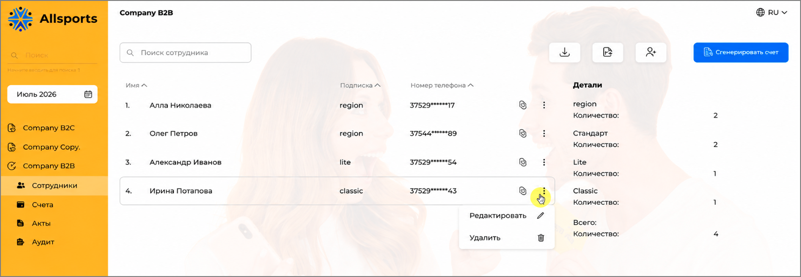

*Рисунок 5 — Раздел «Сотрудники» B2B-компании — список подписчиков с уровнями подписки*

В таблице отображаются:

1. ФИО сотрудника

2. Номер телефона (логин в приложении)

3. Уровень подписки (Region, Lite, Classic, Premium, VIP)

В верхней части страницы расположены:

1. Строка поиска — поиск сотрудника по ФИО или email

2. Иконки действий:

3.  скачать список сотрудников за предыдущий месяц

4.  импортировать список сотрудников (по предложенному шаблону)

5.  добавить сотрудника.

6. Кнопка «Сформировать счёт» — ручная генерация счёта на оплату

 Кнопка контекстного меню открывает функции редактирования и удаления сотрудника из списка.

Блок «Детали»

Блок «Детали» расположен в правой части страницы и отображает сводную информацию о сотрудниках компании по типам подписок.

Для каждого типа подписки отображаются следующие данные:

1. Количество – число сотрудников, которым назначена данная подписка.

Информация группируется по видам подписок.

В нижней части блока отображается раздел «Всего», содержащий:

1. Количество – общее количество сотрудников компании, включённых в расчёт.

2. Стоимость – суммарная стоимость всех активных подписок сотрудников компании.

Данные в блоке обновляются автоматически при добавлении, изменении или удалении сотрудников, а также при изменении назначенных им подписок.

### 4.3. Добавление одного сотрудника

 Для добавления одного сотрудника нажмите иконку. Заполните форму:

1. Введите фамилию, имя и отчество.

2. Введите номер мобильного телефона сотрудника в международном формате. Это логин сотрудника в приложении.

3. Выберите уровень подписки: Region, Lite, Classic, Premium или VIP.

4. Нажмите «Сохранить».

Номер телефона — это логин сотрудника в мобильном приложении. После добавления его нельзя изменить самостоятельно — потребуется обращение в поддержку.

> ℹ Поддерживаются номера телефонов всех стран ЕС, а также белорусские номера (+375).

### 4.4. Импорт списка сотрудников через Excel

Для загрузки большого количества сотрудников используйте импорт через Excel-шаблон.

#### Шаг 1. Скачайте шаблон

 Нажмите иконку импорта. Система предоставит Excel-шаблон, соответствующий модели подписок вашей компании.

*Рисунок 6 – Ссылка на скачивание шаблона импорта сотрудников*

1. Стандартная модель: столбцы Фамилия, Имя, Отчество, Телефон, Email, Уровень подписки.

2. Новая модель (Product Mix): отдельные столбцы для каждого уровня — Region, Lite, Classic, Premium, VIP.

#### Шаг 2. Заполните шаблон

1. Один сотрудник — одна строка.

2. Телефон в международном формате: +375291234567.

3. Не изменяйте заголовки столбцов и структуру файла.

4. Уровень подписки указывается точно как в шаблоне.

#### Шаг 3. Загрузите файл

1.  Нажмите иконку импорта, выберите заполненный файл.

2. Система проверит данные и покажет результат валидации.

3. Поле «Фамилия Имя Отчество» должно содержать не менее двух слов — строка с одним словом отклоняется с сообщением «Введите полное ФИО сотрудника».

4. При наличии ошибок — исправьте строки и повторите загрузку.

5. При успешной проверке — подтвердите импорт.

Импорт выполняется только при отсутствии ошибок во всех строках. Частичный импорт не допускается.

### 4.5. Перенос списка с предыдущего месяца

Ежемесячно компании необходимо генерировать и оплачивать счет за подписку для своих сотрудников.

Если состав подписчиков практически не изменился, воспользуйтесь одним из способов копирования списка сотрудников из предыдущего месяца:

1. нажмите «Скачать предыдущий»;

2. если список сотрудников пуст, нажмите «Скопировать данные прошлого месяца?».

После запуска копирования система:

1. скопирует список сотрудников из предыдущего месяца;

2. проверит соответствие уровней подписки текущей модели;

3. отобразит строки с несоответствиями, если они будут обнаружены.

4. проверит поле «Фамилия Имя Отчество» на то же условие (не менее двух слов), что и при импорте через Excel.

Перенос выполняется только при успешной валидации всех строк. При несоответствиях система покажет список проблемных строк для ручного исправления.

Далее вы можете добавить или удалить сотрудников из списка. После формирования корректного списка нажмите кнопку Сгенерировать счет.

*Рисунок 7 – Генерация счета на оплату за текущий месяц*

Через несколько минут сгенерированный счет отобразится на вкладке Счета компании.

### 4.6. Типы подписок Allsports

Каждому сотруднику назначается один из пяти уровней подписки. Уровень определяет количество доступных объектов и видов активностей.

1. Region — 280+ объектов по всей Беларуси, 60+ вида активностей (бассейны, йога, пилатес).

2. Lite — 75+ объектов в Минске, 25+ видов активностей (тренажёрные залы, фитнес).

3. Classic — 600+ объектов по всей стране, 80+ вида активностей (танцы, стретчинг, единоборства).

4. Premium — 780+ объекта, 110+ видов активностей (теннис, картинг, СПА). Дополнительно 4 визита в объекты «Premium Plus».

5. VIP — 790+ объекта, 110+ видов активностей (массаж, конный спорт, сквош). Дополнительно 4 визита в объекты «VIP Plus».

> ℹ Все уровни предоставляют 1 визит в день и до 31 визита в месяц. Уровень можно изменить при следующем обновлении списка.

### 4.7. Счета

В разделе «Счета» отображаются все выставленные счета за услуги Allsports.

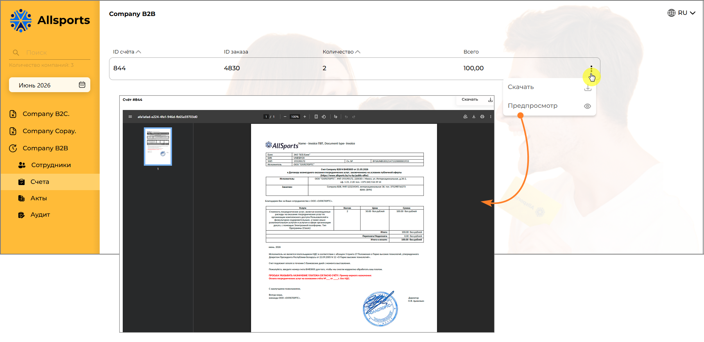

*Рисунок 8 – Список счетов и предварительный просмотр документа*

На странице отображается список доступных счетов со следующей информацией:

1. ID счета – уникальный идентификатор счета в системе.

2. ID заказа – идентификатор заказа, на основании которого был сформирован счет.

3. Количество – количество сотрудников или услуг, включенных в счет.

4. Всего – итоговая сумма счета.

При выборе счета в центральной части страницы открывается область предварительного просмотра документа, позволяющая ознакомиться с его содержимым без скачивания файла.

 Для работы со счетом нажмите кнопку контекстного меню справа от строки счета. Доступны следующие действия:

1. Скачать – загрузка счета на устройство пользователя в формате PDF.

2. Предпросмотр – открытие счета в области просмотра на странице.

Предварительный просмотр позволяет проверить реквизиты, состав услуг, количество подключений и итоговую стоимость перед скачиванием или передачей документа в бухгалтерию.

Если для выбранного периода счета отсутствуют, список счетов будет пустым. Для отображения счетов за другой период выберите необходимый месяц в фильтре, расположенном в левой части страницы.

### 4.8. Акты

В разделе «Акты» хранятся закрывающие документы по каждому расчётному периоду.

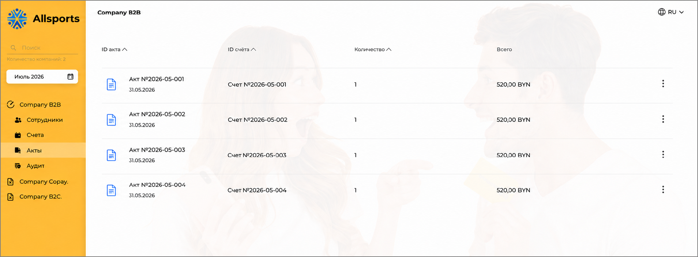

*Рисунок 9 — Раздел «Акты» — список актов с привязкой к счетам*

За текущий месяц акт формируется в конце месяца.

### 4.9. Аудиты

Раздел «Аудит» — это журнал всех изменений, внесённых в список подписчиков компании. Он позволяет отследить, кто, когда и какие изменения производил: добавление сотрудников, изменение уровней подписок, импорт данных.

Как открыть: нажмите «Аудит» в меню нужной компании. В верхней части страницы расположен фильтр по месяцу — выберите нужный период для просмотра истории изменений за конкретный месяц.

*Рисунок 10 -– Журнал аудита действий пользователей*

Таблица аудита содержит следующие столбцы:

1. Дата — дата и точное время внесения изменения (например, 21.05.2026 11:03:41). Можно сортировать по возрастанию и убыванию.

2. Кол-во подписок — количество подписок, затронутых данным действием.

3. Цена — суммарная стоимость изменённых подписок в BYN.

4. ФИО — имя HR-менеджера или администратора системы, который выполнил действие. Можно сортировать по алфавиту.

Для чего используется аудит:

1. Контроль корректности внесённых данных — можно проверить, когда именно был загружен список на следующий месяц.

2. Разграничение ответственности — если в компании несколько HR-менеджеров, аудит показывает, кто из них выполнил конкретное действие.

3. Выверка финансовых данных — при расхождениях в счётах аудит помогает установить, когда и какие изменения повлияли на итоговую сумму.

4. Подтверждение для бухгалтерии — журнал изменений служит дополнительным источником информации при сверке документов.

> ℹ Раздел «Аудит» доступен только для просмотра. Удалить или изменить записи журнала невозможно — это гарантирует достоверность истории изменений.

## 5. Работа с Copay и B2C-компанией

В моделях Copay и B2C сотрудники самостоятельно регистрируются по персональной ссылке компании. Роль HR-менеджера — предоставить ссылку сотрудникам и подтверждать их заявки.

### 5.1. Ссылка для регистрации сотрудников

В меню рядом с названием компании (Copay / B2C) расположена иконка копирования ссылки. Нажмите на неё, чтобы скопировать персональную ссылку для регистрации сотрудников вашей компании.

Способы передачи ссылки сотрудникам: корпоративная рассылка по email, мессенджеры, HR-система компании, корпоративный портал.

Ссылка уникальна для вашей компании. Не передавайте её сотрудникам других организаций.

### 5.2. Как сотрудник регистрируется (процесс самостоятельной регистрации)

После перехода по ссылке сотрудник видит страницу регистрации Allsports.

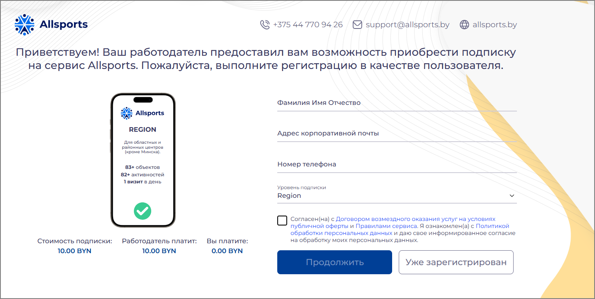

*Рисунок 11 — Страница регистрации сотрудника: форма ввода данных и информация о подписке*

На странице отображается:

1. Карточка подписки с уровнем и количеством доступных объектов.

2. Стоимость подписки — полная стоимость.

3. Работодатель платит — доля компании.

4. Вы платите — доля сотрудника (0.00 BYN, если компания платит полностью).

Сотрудник заполняет форму:

1. Вводит ФИО.

2. Указывает адрес корпоративной почты.

3. Вводит номер мобильного телефона.

4. Выбирает уровень подписки (если доступно несколько).

5. Принимает условия обработки персональных данных и договор оферты.

6. Нажимает «Продолжить».

Система отправляет письмо для подтверждения email:

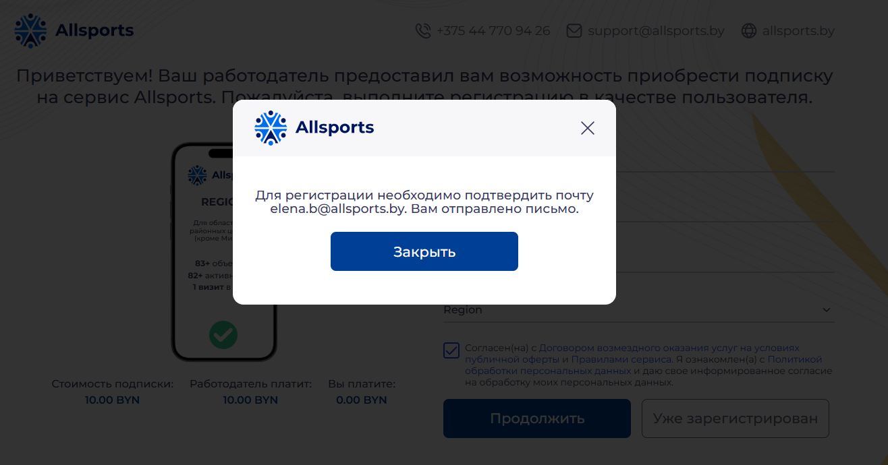

*Рисунок 12 — Уведомление об отправке письма для подтверждения email*

Сотрудник переходит по ссылке в письме. После подтверждения его заявка появляется в разделе «Запросы для подтверждения» в Панели компании HR-менеджера.

### 5.3. Запросы для подтверждения

В этом разделе отображаются все заявки от сотрудников, ожидающие вашего одобрения.

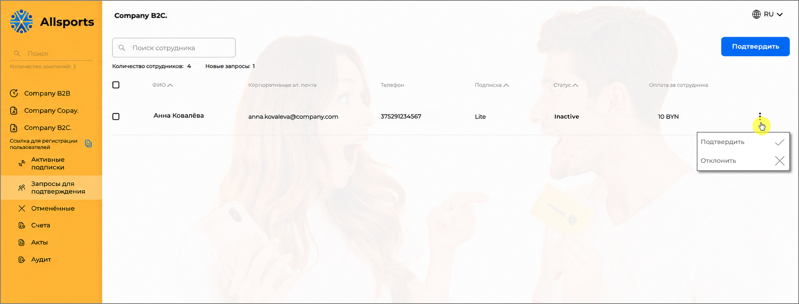

*Рисунок 13 — Раздел «Запросы для подтверждения»: новая заявка сотрудника ожидает решения*

На странице отображаются сотрудники со статусом подписки:

1. Inactive — заявка подана, ещё не обработана

По каждой заявке показаны: ФИО, email, телефон, запрошенный уровень подписки, статус «Ожидает подтверждения», сумма оплаты за сотрудника.

 Для обработки заявки нажмите кнопку контекстного меню в строке сотрудника:

1. — заявка одобрена, сотрудник становится активным подписчиком.

2. — заявка отклонена, сотрудник получает уведомление об отказе.

После подтверждения заявка будет оформлена на следующий расчетный период. Сотрудник получит доступ к мобильному приложению Allsports и сможет посещать спортивные объекты с начала следующего календарного месяца.

### 5.4. Активные подписки

В разделе «Активные подписки» отображаются все сотрудники с действующей подпиской.

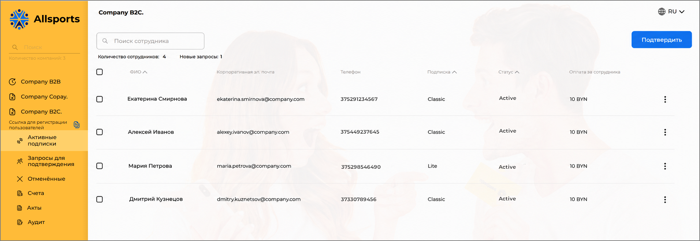

*Рисунок 14 -— Раздел «Активные подписки»: сотрудники с действующими подписками*

Таблица содержит: ФИО, корпоративный email, номер телефона, уровень подписки, статус, сумму оплаты за сотрудника.

На странице отображаются сотрудники со статусом подписки:

1. Active — подписка действует

### 5.5. Отмена подписки сотрудника

HR-менеджер может отменить подписку сотрудника из раздела «Активные подписки». В строке сотрудника в разделе «Активные подписки» нажмите меню действий и выберите «Отменить подписку».

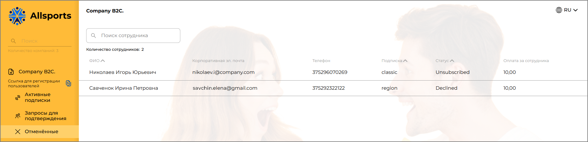

*Рисунок 15 – Подписка сотрудника отменена*

В открывшемся окне подтвердите отмену. После подтверждения сотрудник будет отображаться в разделе «Отменённые» со статусом Declined (а также в разделе «Активные подписки» со статусом Active until <дата окончания текущего расчетного периода> до окончания текущего месяца).

На странице отображается сотрудники со следующими статусами:

1. Declined — заявка была отклонена HR-менеджером

2. Unsubscribed — сотрудник самостоятельно отменил подписку

Подписка отменяется. При наступлении следующего календарного месяца сотрудник теряет доступ к приложению Allsports.

### 5.6. Уведомления

Значок колокольчика в правом верхнем углу Панели компании отображает новые уведомления о событиях.

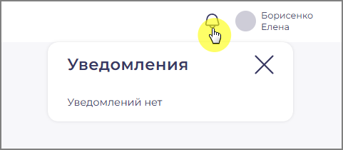

*Рисунок 16 — Панель уведомлений: при наличии новых событий появляется счётчик*

Уведомления информируют о новых заявках от сотрудников, требующих вашего подтверждения.

### 5.7. Счета и акты (Copay/B2C)

Разделы «Счета» и «Акты» для Copay/B2C работают аналогично B2B. Счета формируются автоматически по итогам расчётного периода.

> ℹ Акт за текущий месяц формируется в последний день месяца. До этой даты кнопка «Скачать акт» неактивна.

## 6. Статистика (Engagement Report)

Раздел статистики доступен B2B-компаниям, для которых менеджер Allsports активировал эту функцию. Если вкладка отсутствует — обратитесь к вашему менеджеру.

> ℹ Раздел статистики отображает данные только за завершённые календарные месяцы. Данные за текущий месяц недоступны.

### 6.1. Активность пользователей

На вкладке «Engagement Report» отображаются:

1. Total Registered Memberships — общее число подписчиков компании

2. Active Memberships — число уникальных сотрудников, совершивших хотя бы 1 визит за прошлый месяц

3. % of Total Registered — доля активных от общего числа подписчиков

Активным считается сотрудник, воспользовавшийся приложением хотя бы один раз за предыдущий календарный месяц.

### 6.2. Посещаемость объектов (Partner Usage Breakdown)

Блок Partner Usage Breakdown показывает, какие спортивные объекты посещали ваши сотрудники. Представлен в виде горизонтальной диаграммы.

По каждому объекту:

1. Название объекта

2. % от общего числа визитов (% of Total Visits)

3. Горизонтальный индикатор для наглядного сравнения

Объекты отсортированы по убыванию популярности.

В статистике не отображаются персональные данные сотрудников — только агрегированные показатели.

## 7. Контакты и поддержка

ООО «ОЛЛСПОРТС» — оператор системы Allsports.

1. Адрес: 220030, Республика Беларусь, г. Минск, ул. Интернациональная, 36-2, офисы 2-20, 1-21

2. Телефон: +375 44 771 09 47

3. Email: support@allsports.by

4. Сайт: allsports.by

Время работы службы поддержки:

1. Будни (Пн–Пт): 9:00–18:00

2. Суббота, воскресенье: выходной

> ℹ По вопросам подключения, изменения условий договора, активации статистики и другим вопросам — обращайтесь к вашему персональному менеджеру Allsports.
