# Мобильное приложение ALLSPORTS

  <a class="doc-download-link" href="_assets/documents/mobile-app-user-guide.docx">Скачать исходный DOCX</a>

  

  

    
Руководство пользователя

    
Allsports Documentation

  

  
Инструкция по мобильному приложению Allsports: установка, вход, поиск объектов, оформление визитов и работа с профилем пользователя.

  

    

      
Платформы

      
iOS, Android, Huawei AppGallery

    

    

      
Основные сценарии

      
Установка, авторизация, визиты, профиль

    

    

      
Формат

      
Веб-руководство + исходный DOCX

    

  

## 1. Введение

Allsports — корпоративный спортивный абонемент, предоставляющий доступ к широкой сети спортивных объектов по всей Беларуси. Приложение Allsports даёт возможность находить удобные спортивные и развлекательные заведения рядом, просматривать описание и расписание каждого объекта, а также регистрировать посещения в несколько касаний.

По подписке Allsports доступны 700+ объектов и 118 видов активностей по всей стране — фитнес-клубы, бассейны, теннисные корты, единоборства, танцы, йога и многое другое.

Приложение доступно для скачивания на трёх платформах:

1. App Store (iOS): apps.apple.com/by/app/allsports/id1555419187

1. AppGallery (Huawei): appgallery.huawei.com/#/app/C104288727

1. Google Play (Android): play.google.com/store/apps/details?id=by.allsports.holder

## 2. Установка приложения и авторизация

Чтобы установить приложение Allsports на мобильное устройство:

1. Откройте магазин приложений (App Store, Google Play или AppGallery).

1. В строке поиска введите «Allsports».

1. Нажмите «Установить» и дождитесь завершения загрузки.

1. Разрешите приложению доступ к геолокации — это необходимо для функции «Вход по локации».

1. Откройте приложение и выполните авторизацию.

> ⚠ Для работы приложения требуется подключение к интернету. Рекомендуется использовать Wi-Fi или мобильный интернет с хорошим покрытием. Также необходимо предоставить приложению доступ к камере и загрузить фото.

При использовании приложения ВПН должен быть отключен.

### 2.1 Авторизация в приложении

Для входа в приложение необходимы: корпоративная подписка Allsports, оформленная вашей компанией-работодателем и номер мобильного телефона, привязанный к вашей подписке.

> ⚠ Важно: авторизация возможна только на одном устройстве одновременно. При смене устройства новый код активации необходимо запрашивать у ответственного лица в вашей компании. Процесс может занять несколько дней.

#### 2.1.1 Ввод номера телефона

При первом запуске или при отсутствии активной сессии откроется экран авторизации. Нажмите кнопку «Уже есть подписка Allsports».

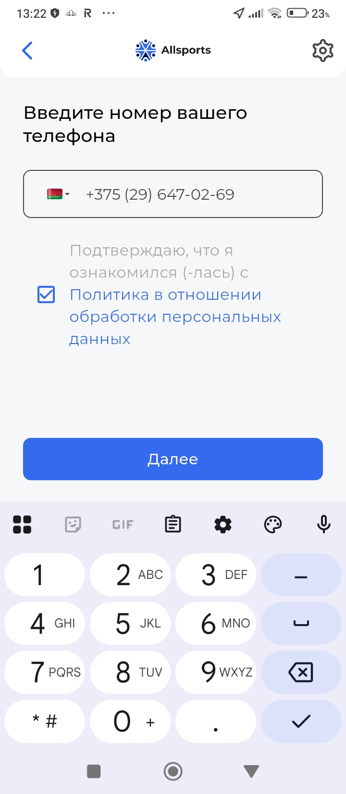

*Рис. 1 — Экран ввода номера телефона*

1. Выберите код страны (по умолчанию Беларусь +375).

1. Введите номер мобильного телефона, привязанный к вашей подписке.

1. Ознакомьтесь с Политикой обработки персональных данных и отметьте чекбокс для продолжения авторизации.

1. Нажмите кнопку «Далее».

#### 2.1.2 Подтверждение по SMS

После ввода номера на него придёт одноразовый SMS-код для подтверждения входа.

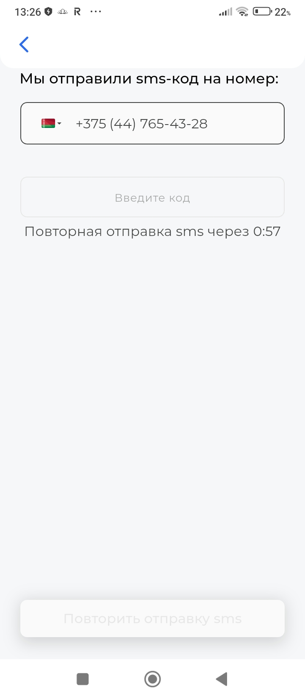

*Рис. 2 — Экран ввода SMS-кода*

1. Введите полученный код в поле «Введите код».

1. Если код не пришёл — дождитесь истечения таймера (1 минута) и нажмите «Повторить отправку SMS».

Если количество попыток входа исчерпано, отображается сообщение: «Привет! Для авторизации свяжитесь с технической поддержкой Allsports». В этом случае обратитесь в техническую поддержку Allsports (см. раздел 11).

## 3 Типы подписок Allsports

Allsports предлагает пять уровней корпоративной подписки. Тип подписки определяет количество доступных объектов и видов активностей.

> ⚠ Подписка оформляется работодателем; самостоятельно изменить её уровень через приложение нельзя.

Все типы подписок предоставляют 1 визит в день и до 31 визита в месяц, а также возможность приостановить подписку на следующий месяц.

1. Region — подписка для регионов Беларуси. Доступно 280+ объектов по всей стране (за исключением г. Минск и его спутников) и 60+ вида активностей, в том числе бассейны, пилатес, йога.

1. Lite — базовая подписка для Минска. Доступно 70+ объектов в столице и 20+ видов активностей: тренажёрные залы, фитнес и другие направления.

1. Classic — расширенная подписка. Доступно 600+ объектов по всей стране и 80+ вида активностей, включая танцы, стретчинг и боевые искусства.

1. Premium — подписка с расширенными возможностями. Доступно 780+ объектов и 110+ видов активностей: теннис, картинг, СПА и другие. Дополнительно предоставляется 4 визита в месяц в объекты из списка «Premium Plus» (значок PLUS на карте).

1. VIP — максимальный уровень подписки. Доступно 700+ объекта и 110+ видов активностей, включая массаж, конный спорт и сквош. Дополнительно предоставляется 4 визита в месяц в объекты из списка «VIP Plus».

Тип вашей подписки отображается в приложении под именем на главной странице раздела «Профиль».

Подписка действует строго с первого по последнее число месяца.

## 4. Система идентификации профиля

В Allsports предусмотрена обязательная система фотоидентификации пользователей. Это сделано для того, чтобы подпиской пользовался только её законный владелец.

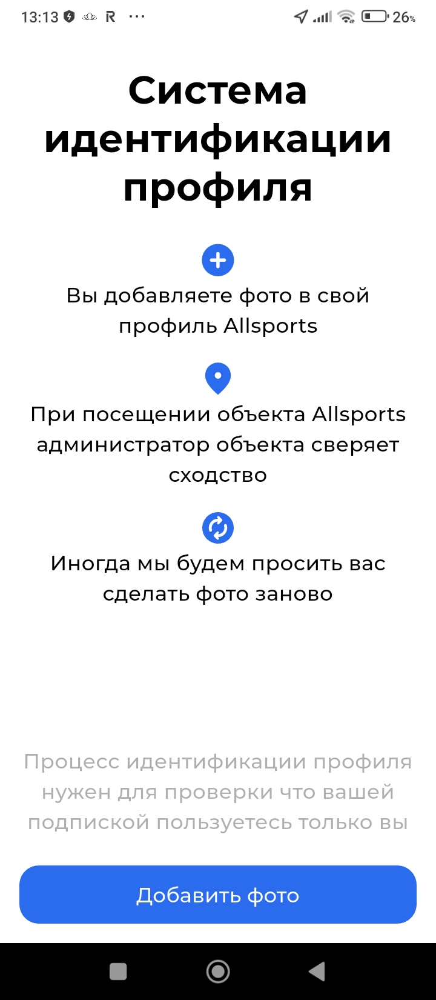

*Рис. 3 — Система идентификации профиля*

Как это работает:

1. Вы добавляете фотографию своего лица в профиль Allsports.

1. При каждом посещении объекта администратор сверяет вашу фотографию в приложении с вашим внешним видом.

1. Система может периодически просить обновить фото — это плановая процедура.

> ⚠ Убедитесь, что фото чёткое, хорошо освещённое и отображает ваше лицо без посторонних предметов (головных уборов, солнечных очков и т. д.). Добавить или обновить фото можно в разделе «Профиль» → «Редактирование профиля» → «Сменить фото».

## 5. Главный экран, вкладка Объекты

На главном экране во вкладке «Объекты» отображается карта Беларуси с отмеченными спортивными объектами партнёрской сети. Вкладка открывается нажатием значка геолокации в левой части нижнего меню.

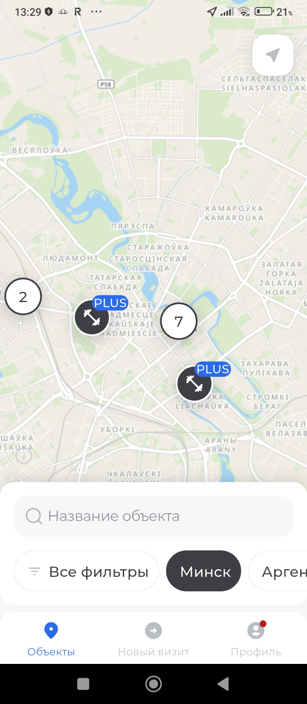

*Рис. 4 — Главный экран: карта объектов*

Условные обозначения на карте:

1. Тёмный кружок со значком штанги — стандартный спортивный объект.

1. Кружок с меткой PLUS — объект с расширенными (Plus) услугами.

1. Цифра в белом кружке — кластер нескольких объектов. Нажмите для приближения и просмотра каждого.

Нажмите кнопку со стрелкой компаса в правом верхнем углу, чтобы центрировать карту на вашем текущем местоположении.

### 5.1. Поиск объекта по названию

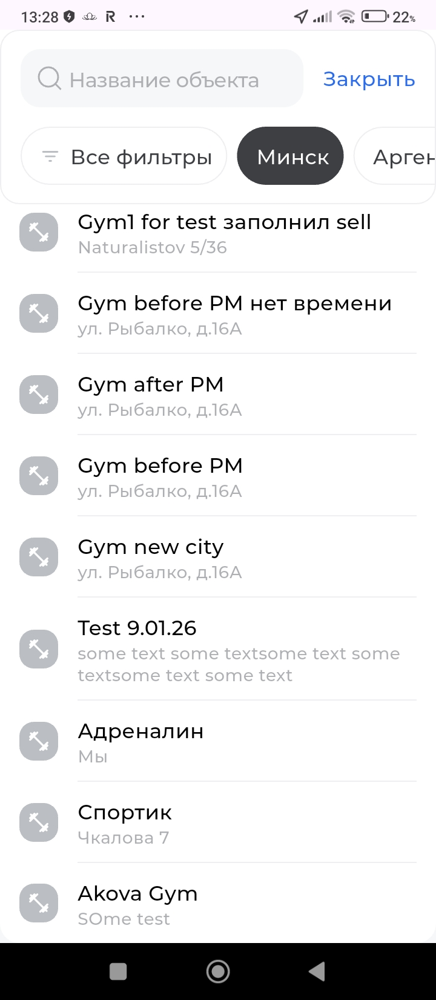

*Рис. 5 — Поиск объектов по названию*

В нижней части экрана расположена строка поиска «Название объекта». Начните вводить название спортивного клуба или его адрес — результаты появятся в виде прокручиваемого списка.

## 6. Фильтрация объектов

Для уточнённого поиска воспользуйтесь фильтрами. Нажмите кнопку «Все фильтры» в нижней части экрана. Панель фильтров содержит три группы параметров. Выбрав нужные параметры, нажмите «Показать объекты».

|  |  |  |
| --- | --- | --- |

*Рис. 6 — Фильтры: активности / особенности объекта / город и район*

### 6.1. Активности

Список видов спорта и активностей, доступных к посещению: аргентинское танго, аренда зала, аренда корта, афро-танцы, баня, баскетбол, боди баланс, боулинг и более 100 других направлений. Выберите интересующий вид спорта — карта покажет только те объекты, которые его предоставляют.

Нажмите «Загрузить больше» для просмотра полного списка активностей.

### 6.2. Особенности объекта

Дополнительные критерии для отбора объектов:

1. Объекты с Plus услугами — расширенный пакет услуг по вашей подписке.

1. Бесплатная парковка — наличие бесплатной парковки для посетителей.

1. Доплата на объекте — объекты, на которых может потребоваться дополнительная оплата за отдельные услуги.

1. Круглосуточный — работающие 24 часа в сутки без выходных.

1. Wi-Fi — бесплатный беспроводной интернет.

1. Услуги для родителей с детьми — детская зона, детские программы или возможность прийти с ребёнком.

1. Сезонное обслуживание — работает только в определённый сезон.

1. Открыто сейчас — отображать только объекты, работающие в данный момент.

### 6.3. Город и район

Выберите город или населённый пункт: Минск, Гомель, Могилёв, Брест, Гродно, Витебск, Сморгонь, Смолевичи и другие города Беларуси. Нажмите «Загрузить больше» для просмотра полного списка.

## 7. Информация об объекте

Нажмите на значок объекта на карте или на строку в списке результатов поиска, чтобы открыть карточку объекта. Она появляется в нижней части экрана и содержит три вкладки.

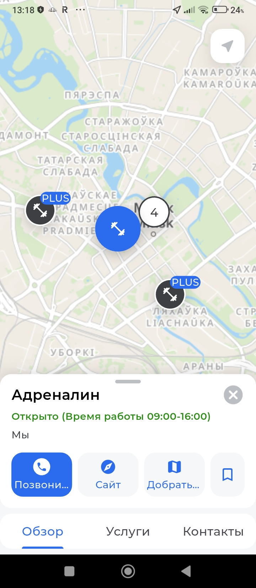

*Рис. 7 — Карточка объекта на карте*

### 7.1. Вкладка «Обзор»

Вкладка «Обзор» содержит описание спортивного объекта: особенности, условия посещения, важные инструкции от администрации заведения.

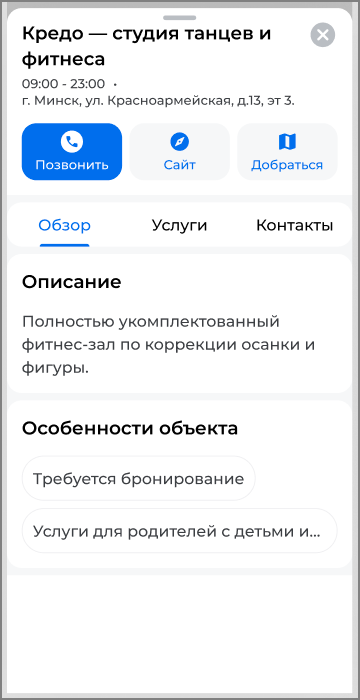

*Рис. 8 — Вкладка «Обзор»: описание объекта*

Если для посещения объекта требуется предварительное бронирование, свяжитесь со спортивным объектом напрямую. Возможность бронирования через мобильное приложение Allsports не предусмотрена.

### 7.2. Вкладка «Услуги»

Вкладка «Услуги» отображает перечень услуг, доступных на объекте по вашей подписке. Услуги разделены на группы: «Безлимитные услуги вашей подписки» — услуги без ограничения по количеству посещений, и «Plus услуги вашей подписки» — услуги с ограниченным количеством визитов в месяц (рядом с названием группы указывается, сколько визитов осталось; лимит обновляется в начале каждого месяца).

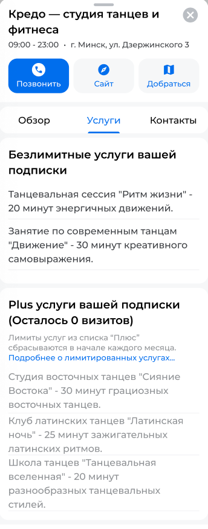

*Рис. 9 — Вкладка «Услуги»: список услуг по подписке*

### 7.3. Вкладка «Контакты»

Вкладка «Контакты» отображает контактные данные объекта и расписание работы. Нажмите на номер телефона, чтобы позвонить напрямую в заведение. Адрес объекта указан в верхней части карточки объекта и поддерживает отображение в несколько строк для длинных адресов.

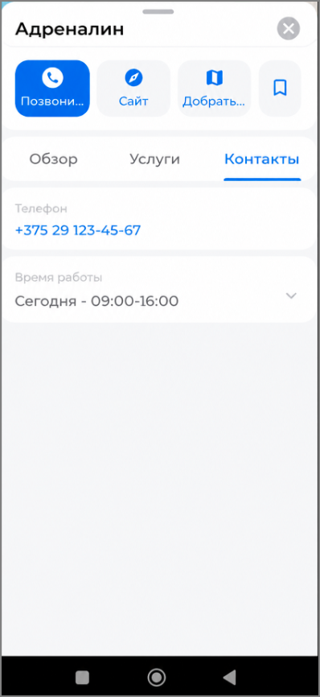

*Рис. 10 — Вкладка «Контакты»: контактные данные и время работы*

### 7.4. Кнопки быстрых действий

В верхней части карточки объекта расположены четыре кнопки:

1. Позвонить — звонок напрямую в заведение.

1. Сайт — открыть официальный сайт объекта в браузере.

1. Добраться — построить маршрут до объекта. При нажатии предлагается выбор: открыть в Google Maps или скопировать адрес.

1. Сохранить (значок закладки) — добавить объект в список «Избранное».

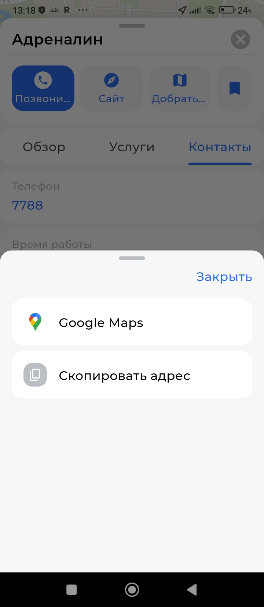

*Рис. 11 — Выбор способа навигации до объекта*

## 8. Избранные объекты

Вы можете сохранять часто посещаемые или понравившиеся спортивные объекты в список «Избранное» для быстрого доступа к ним в дальнейшем.

### 8.1. Добавление в избранное

1. Откройте карточку нужного объекта на карте или в списке поиска.

2. Нажмите значок закладки в правом верхнем углу карточки.

1. Объект будет добавлен в список избранного.

### 8.2. Просмотр избранного

Для просмотра списка избранных объектов перейдите: «Профиль» → «Избранные объекты».

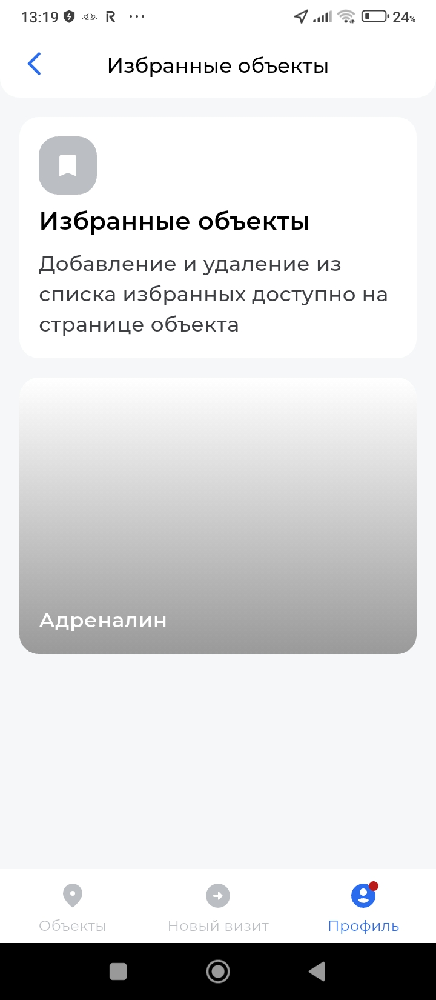

*Рис. 12 — Список избранных объектов*

> ⚠ Чтобы удалить объект из избранного, откройте его карточку и нажмите на значок закладки ещё раз — он станет неактивным.

## 9. Оформление визита

Для того чтобы посетить спортивный объект по подписке Allsports, необходимо зарегистрировать визит в приложении. Нажмите на вкладку «Новый визит» в центре нижнего меню. Доступны два способа регистрации визита: сканирование QR- кода и вход по локации.

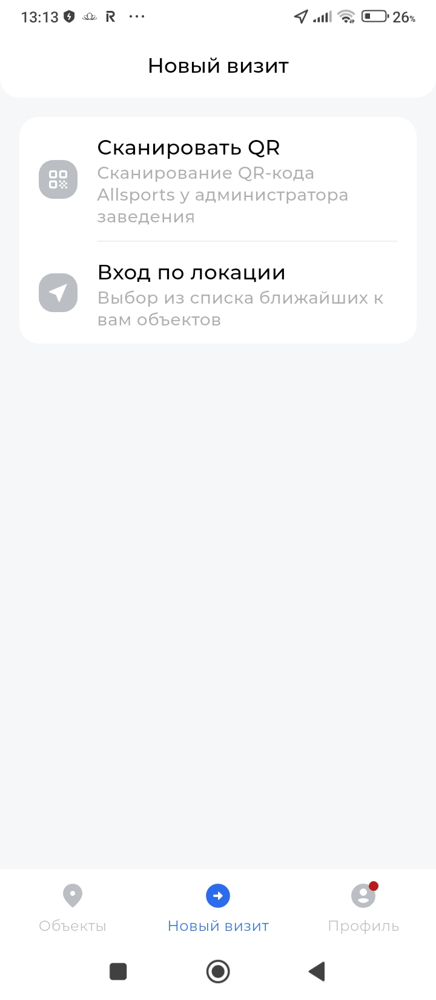

*Рис. 13 — Экран «Новый визит»: выбор способа входа*

### 9.1. Сканирование QR-кода (рекомендуемый способ)

QR-код Allsports находится на стойке администратора в каждом партнёрском заведении.

1. Перейдите на вкладку «Новый визит».

1. Выберите «Сканировать QR».

1. Наведите камеру телефона на QR-код Allsports, который находится у администратора объекта.

1. После успешного считывания QR-кода и выбора необходимой услуги визит будет зарегистрирован. Администратор проверит соответствие фотографии в приложении и вашей внешности. При невозможности идентификации по фотографии попросит предъявить документ, удостоверяющий личность.

### 9.2. Вход по локации

Этот способ позволяет автоматически определить ближайший к вам объект Allsports и выбрать его из списка.

1. Перейдите на вкладку «Новый визит».

1. Выберите «Вход по локации».

1. Разрешите приложению доступ к вашему местоположению.

1. Из предложенного списка ближайших объектов выберите нужный и подтвердите визит.

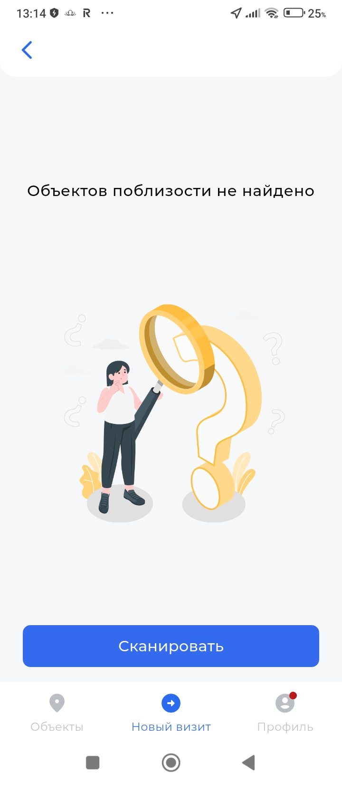

*Рис. 14 — Сообщение: объекты поблизости не найдены*

> ⚠ Если приложение не находит объектов поблизости — убедитесь, что разрешение на геолокацию включено в настройках телефона. Также проверьте, что вы физически находитесь рядом с объектом Allsports. В этом случае воспользуйтесь сканированием QR-кода.

## 10. Раздел «Профиль»

Раздел «Профиль» находится в правой части нижнего меню приложения. Здесь собраны все персональные настройки и параметры приложения.

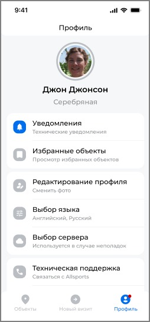

*Рис. 15 — Главная страница раздела «Профиль»*

На главной странице профиля отображаются: фотография пользователя, имя и фамилия, тип подписки (например, Premium). Доступны следующие разделы:

1. Уведомления — системные сообщения от Allsports.

1. Избранные объекты — список сохранённых спортивных заведений.

1. Редактирование профиля — обновление фотографии для идентификации.

1. Выбор языка — смена языка интерфейса.

1. Выбор сервера — техническая настройка на случай проблем с подключением.

1. Техническая поддержка — контакты службы поддержки Allsports.

1. Информация — правовые документы сервиса.

### 10.1. Уведомления

В этом разделе отображаются все системные сообщения: изменения правил сервиса, напоминания об окончании подписки и другие важные уведомления. Красная точка на иконке «Профиль» в нижнем меню сигнализирует о непрочитанных уведомлениях. Аналогичный акцентный индикатор появляется на строке «Уведомления» в разделе «Профиль», если есть непрочитанные уведомления.

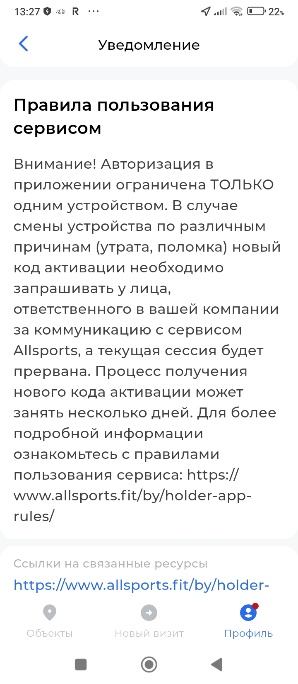
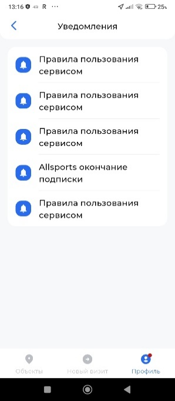

*Рис. 16 — Список уведомлений*

### 10.2. Редактирование профиля

Для обновления фотографии профиля нажмите «Редактирование профиля» → «Сменить фото». Следуйте инструкциям на экране, чтобы сделать новый снимок.

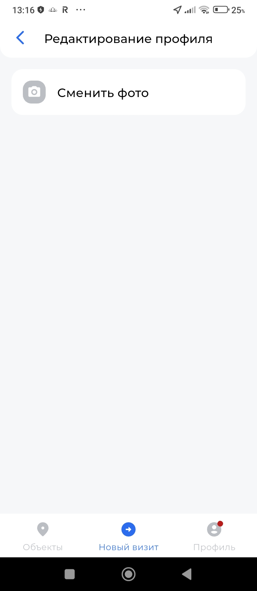

*Рис. 17 — Редактирование профиля: смена фото*

> ⚠ Используйте чёткое, хорошо освещённое фото лица анфас. Это обязательное требование для прохождения идентификации на объекте.

### 10.3. Выбор языка

Приложение поддерживает четыре языка интерфейса: русский, английский, армянский и белорусский. Выберите нужный язык — изменение вступит в силу немедленно.

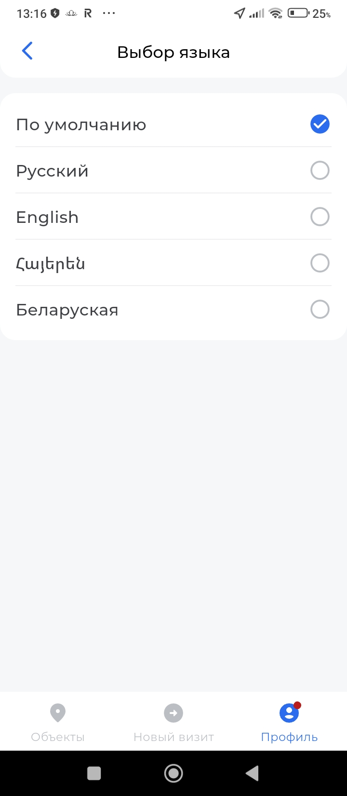

*Рис. 18 — Экран выбора языка интерфейса*

## 11. Техническая поддержка

Если у вас возникли вопросы или проблемы при использовании приложения, вы можете обратиться в службу технической поддержки Allsports. Перейдите в раздел «Профиль» → «Техническая поддержка».

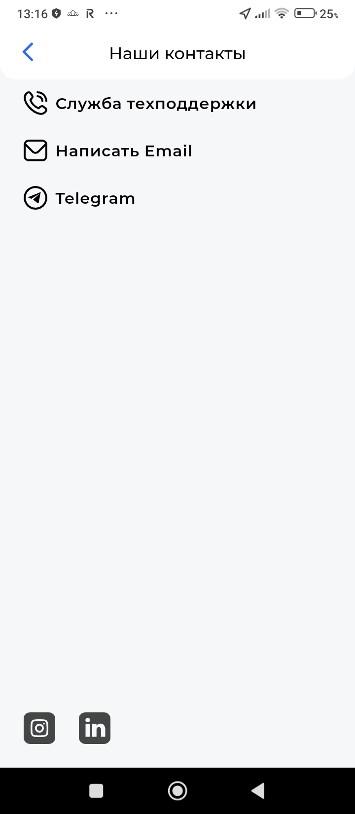

*Рис. 19 — Контакты технической поддержки*

Доступные каналы связи:

1. Служба техподдержки — прямой звонок специалисту

- Телефон: 375 44 770 94 26

1. Написать Email — отправить письмо на адрес support@allsports.by

1. Telegram — обращение через мессенджер Telegram

Также на странице контактов размещены ссылки на официальные страницы Allsports в Instagram и LinkedIn.

## 12. Раздел «Информация»

В разделе «Профиль» → «Информация» размещены все правовые документы, связанные с использованием сервиса Allsports.

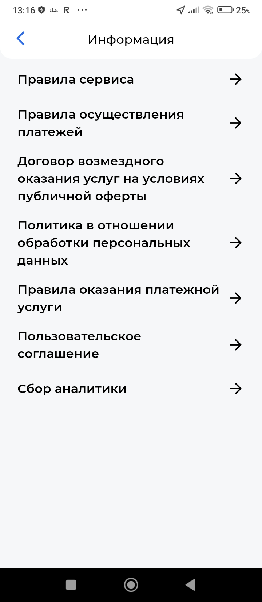

*Рис. 20 — Раздел «Информация»: правовые документы*

1. Правила сервиса — основные условия использования сервиса Allsports.

1. Правила осуществления платежей — порядок и условия оплаты услуг.

1. Договор возмездного оказания услуг — публичная оферта на оказание услуг.

1. Политика обработки персональных данных — информация о защите и обработке ваших персональных данных.

1. Правила оказания платёжной услуги — условия проведения платёжных операций.

1. Пользовательское соглашение — соглашение между пользователем и ООО «ОЛЛСПОРТС».

1. Сбор аналитики — информация о сборе и использовании аналитических данных приложения.

## Контактная информация

ООО «ОЛЛСПОРТС»

УНП 193190172

Республика Беларусь, 220030 г. Минск

ул. Интернациональная, 36-2, офисы 2-20, 1-21

1. Телефон: +375 44 770 94 26

1. Email: support@allsports.by

1. Сайт: www.allsports.by

1. Instagram: instagram.com/allsports.by
