# Supplier panel AllSPORTS

  <a class="doc-download-link" href="_assets/documents/partner-panel-user-guide.docx">Скачать исходный DOCX</a>

  

  

    
Руководство пользователя

    
Allsports Documentation

  

  
Инструкция для партнеров Allsports по работе с визитами, историей посещений, документами и карточкой спортивного объекта.

  

    

      
Для кого

      
Партнеры и администраторы объектов

    

    

      
Основные разделы

      
Визиты, история, документы, описание объекта

    

    

      
Формат

      
Веб-версия инструкции + исходный DOCX

    

  

## 1. О системе

AllSports — крупнейший корпоративный спортивный абонемент Беларуси. Более 700 спортивных объектов и 100+ видов активностей по всей стране: фитнес-клубы, бассейны, теннисные корты, единоборства, танцы, СПА и десятки других направлений — всё в одном мобильном приложении.

Тысячи сотрудников белорусских компаний ежедневно используют AllSports для занятий спортом. Став партнёром сети, ваш объект автоматически становится доступен этой активной аудитории — без рекламных затрат и без лишних усилий с вашей стороны.

Партнёрская панель AllSports — это личный инструмент управления потоком абонентов: подтверждение визитов, история посещений, финансовые документы и информация об объекте — всё в одном месте.

## 2. Почему AllSports выгоден вашему объекту

Партнёрство с AllSports — это не просто присутствие в каталоге. Это полноценный канал привлечения клиентов, который работает за вас круглосуточно.

Новые клиенты без затрат на маркетинг — AllSports самостоятельно привлекает абонентов и направляет их на ваш объект. Вы не тратите ни рубля на рекламу — мы делаем это за вас. Тысячи активных пользователей открывают приложение каждый день и выбирают объект для тренировки.

💰 Гарантированный доход — Каждый подтверждённый визит = оплата. Никаких непроданных абонементов, никаких «не пришёл и не предупредил». Система автоматически фиксирует каждое посещение, а ежемесячный акт формируется без вашего участия.

📈 Загрузка в часы низкого спроса — Абоненты AllSports приходят в разное время — в том числе в утренние часы и в будни, когда ваш зал обычно полупустой. Партнёрство помогает выровнять загрузку и получать доход в непиковое время.

🤝 Нулевые инвестиции при подключении — Стать партнёром AllSports можно бесплатно. Никаких вступительных взносов, никакого оборудования, никаких изменений в работе персонала. Достаточно установить QR-код AllSports на ресепшн — и всё готово.

📱 Цифровой документооборот — Забудьте о бумажных актах и ручном учёте. Все финансовые документы за любой период доступны в партнёрской панели в один клик. Скачивайте, отправляйте в бухгалтерию, архивируйте — без лишних звонков и встреч.

🔒 Прозрачность и контроль — Полная история посещений с датой, временем, услугой и стоимостью доступна в любой момент. Видите, какие услуги популярны, в какое время больше всего визитов — используйте эти данные для развития объекта.

🛠 Поддержка 7 дней в неделю — Команда AllSports на связи с 09:00 до 21:00 в будни и с 09:00 до 19:00 в выходные. По телефону, email, Telegram и Viber — выбирайте удобный способ.

🌍 Аудитория корпоративных клиентов — Абоненты AllSports — сотрудники крупных и средних компаний с активной позицией и стабильным доходом. Это платёжеспособная аудитория, которая ценит качество и регулярно посещает спортивные объекты.

Вывод прост: AllSports приводит клиентов, вы оказываете услугу, система считает деньги. Партнёрская панель — ваш инструмент для управления этим процессом.

## 3. Вход в систему

Для входа в партнёрскую панель перейдите по адресу зал.оллспортс.бел и введите логин и пароль, выданные вам менеджером AllSports. После успешной авторизации вы попадёте на главный экран — страницу регистрации визитов.

## 4. Регистрация визитов

Регистрация визитов — основная рабочая функция панели. Каждый раз, когда абонент AllSports приходит в ваш объект и создаёт визит через мобильное приложение, он ожидает подтверждения с вашей стороны. Подтверждение открывает абоненту доступ к услуге и фиксирует посещение в системе — а значит, гарантирует оплату именно этого визита для вашего объекта.

### 4.1. Выбор администратора на смене

Перед началом работы выберите из выпадающего списка «Администратор» имя сотрудника, который принимает абонентов в данный момент. Это позволяет отследить, кто из сотрудников обработал каждый конкретный визит.

Если нужного сотрудника нет в списке, нажмите «+ Добавить администратора» и введите его имя. Администратор будет сохранён для последующего использования.

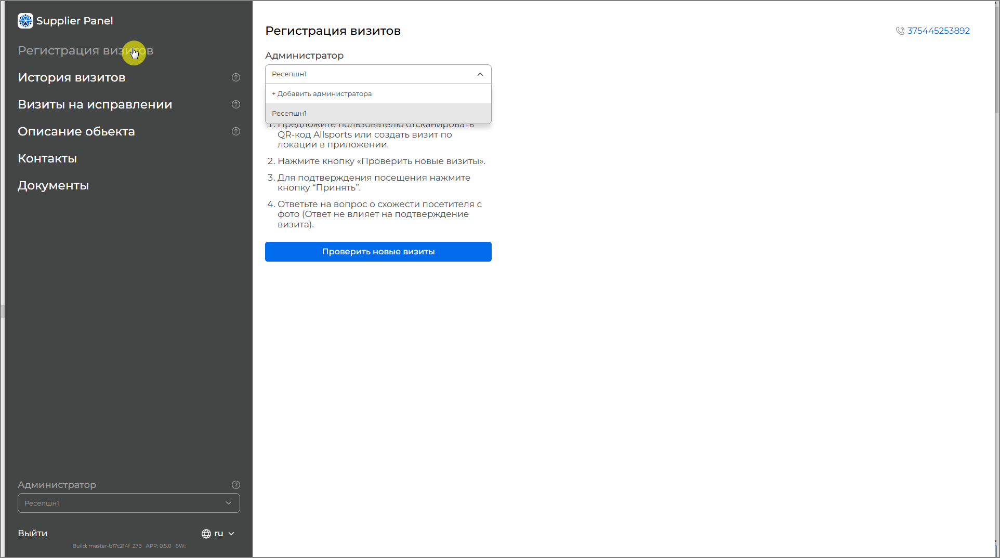

*Рис. 1 — Выбор администратора на смене*

### 4.2. Проверка и подтверждение новых визитов

Для просмотра поступивших визитов нажмите кнопку «Проверить новые визиты». Система отобразит список абонентов, ожидающих подтверждения.

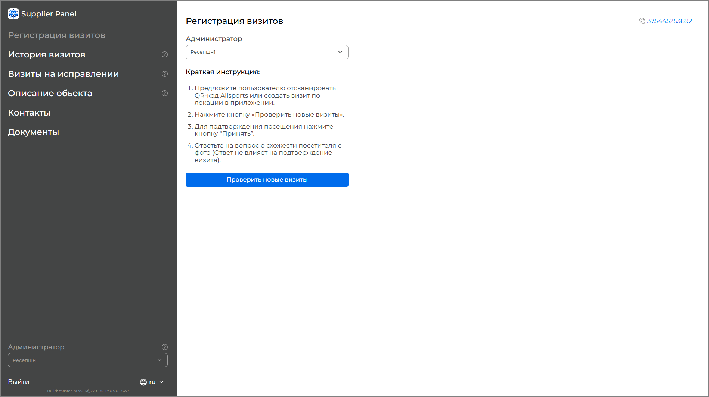

*Рис. 2 — Главный экран регистрации визитов*

Процесс подтверждения визита:

1. Абонент приходит в ваш объект и открывает мобильное приложение AllSports.

2. Абонент создаёт визит — по геолокации или сканированием QR-кода AllSports на объекте.

3. Визит появляется в партнёрской панели со статусом «ожидание».

4. Администратор нажимает «Проверить новые визиты» и подтверждает визит кнопкой «Принять».

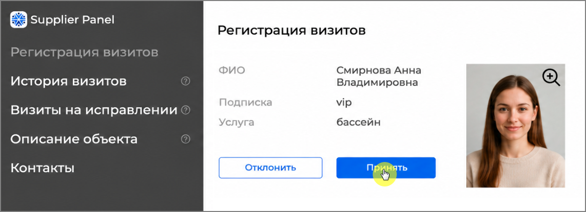

5. В приложении абонента появляется QR-код и таймер — подтверждение доступа к услуге.

## 5. История визитов

Раздел «История визитов» — ваш финансовый дашборд. Здесь в режиме реального времени отображается, сколько абонентов побывало на вашем объекте, какие услуги они получили и на какую сумму. Это прозрачный учёт без таблиц Excel и ручного подсчёта.

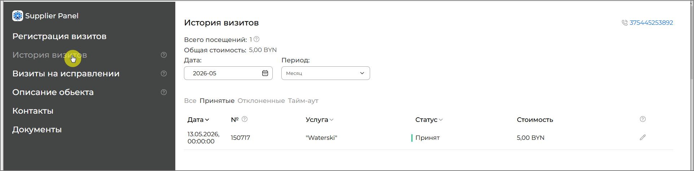

*Рис. 3 — Раздел «История визитов»*

### 5.1. Сводные показатели

В верхней части страницы отображаются:

1. Всего посещений — общее число визитов за выбранный период;

2. Общая стоимость — суммарная стоимость всех визитов в белорусских рублях. Отображение информации зависит от роли пользователя в системе.

Эти данные автоматически пересчитываются при изменении периода или фильтра статуса.

### 5.2. Выбор периода

По умолчанию отображается текущий месяц. Для изменения периода воспользуйтесь выпадающим списком:

1. Месяц — все визиты за выбранный календарный месяц;

2. Неделя — визиты за выбранную неделю;

3. День — визиты за конкретный день;

4. Интервал — произвольный диапазон дат.

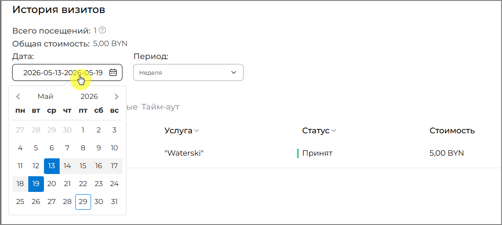

*Рис. 4 — Выбор периода отображения*

### 5.3. Фильтрация по статусу

Список визитов можно отфильтровать по статусу с помощью вкладок:

1. Все — все визиты без фильтрации;

2. Принятые — визиты, успешно подтверждённые администратором;

3. Отклонённые — визиты, отклонённые администратором;

4. Тайм-аут — визиты, не подтверждённые в отведённое время.

### 5.4. Таблица визитов

Каждая строка таблицы содержит: дату и время визита, уникальный номер визита, название услуги, статус и стоимость. Нажав на значок редактирования в строке, можно просмотреть детали визита и при необходимости отправить запрос на корректировку.

### 5.5. Запрос на корректировку

Если в визите допущена ошибка — например, неверная услуга или статус — вы можете инициировать запрос на корректировку непосредственно из истории визитов.

Для этого:

1. Нажмите значок редактирования рядом с нужным визитом.

2. В открывшемся окне при необходимости измените услугу или статус.

3. Укажите причину корректировки в поле «Причина корректировки».

4. Нажмите «Исправить» для отправки запроса на рассмотрение менеджером AllSports.

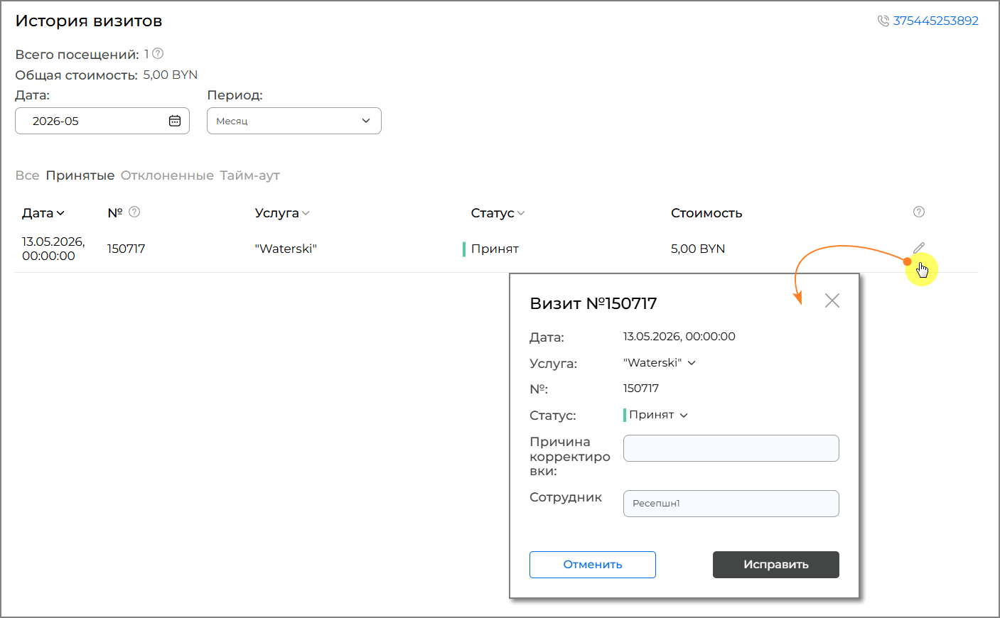

*Рис. 5 — Форма запроса на корректировку визита*

Запрос передаётся на рассмотрение в AllSports. До принятия решения исходные данные визита остаются без изменений. Статус обработки отображается в разделе «Визиты на исправлении».

## 6. Визиты на исправлении

В разделе «Визиты на исправлении» отображаются все визиты, по которым был отправлен запрос на корректировку за выбранный период. Это позволяет отслеживать статус рассмотрения каждого запроса.

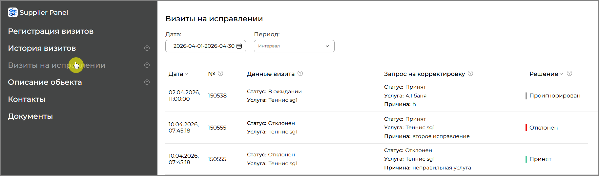

*Рис. 6 — Раздел «Визиты на исправлении»*

Таблица содержит следующие столбцы:

1. Дата — дата и время исходного визита;

2. № — уникальный идентификатор визита для быстрого поиска при обращении в техническую поддержку;

3. Данные визита — детали визита до корректировки;

4. Запрос на корректировку — суть и причина поданного запроса;

5. Решение — статус обработки запроса. При положительном решении данные исходного визита будут изменены.

## 7. Описание объекта

Раздел «Описание объекта» — ваша витрина в экосистеме AllSports. Именно эту информацию видят тысячи абонентов, когда выбирают объект для тренировки в мобильном приложении и на сайте allsports.by. Чем подробнее и привлекательнее заполнены данные, тем выше шанс, что абонент выберет именно ваш объект.

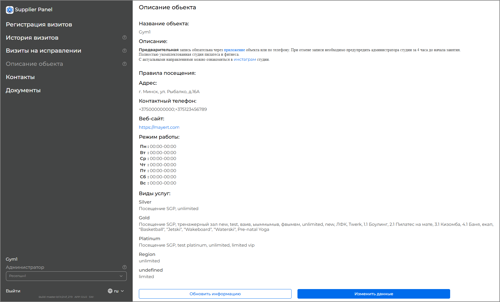

*Рис. 7 — Страница описания объекта*

### 7.1. Основная информация

В разделе отображаются следующие данные объекта:

1. Название — наименование вашего спортивного объекта;

2. Описание — краткое описание объекта и предоставляемых услуг;

3. Правила посещения — условия, которые должны соблюдать абоненты;

4. Адрес — физический адрес объекта;

5. Контактный телефон — номера телефонов для связи (можно указать несколько через точку с запятой);

6. Веб-сайт — ссылка на сайт вашего объекта;

7. Режим работы — часы работы по каждому дню недели.

### 7.2. Услуги по уровням подписки

В нижней части страницы отображаются услуги вашего объекта, доступные абонентам с различными уровнями подписки AllSports Region, Lite, Classic, Premium,VIP. Для каждой услуги указаны тип (безлимитный или с ограниченным числом визитов) и наименование. Эта информация формируется совместно с менеджером AllSports при подключении объекта к системе.

### 7.3. Обновление информации

Актуальный список услуг на странице обновляется автоматически. Если требуется изменить основные данные объекта, вы можете:

1. нажать «Изменить данные» — открывается модальное окно для обращения со службой поддержки.

Изменения, внесённые через обращение в поддержку, вступают в силу после обработки запроса и отображаются абонентам в приложении и на сайте AllSports.

## 8. Документы

Раздел «Документы» — полностью цифровой архив финансовых документов. Никаких бумажных актов, никаких звонков в AllSports за справками. Все документы за любой период доступны в панели в один клик, готовы к скачиванию и отправке в бухгалтерию.

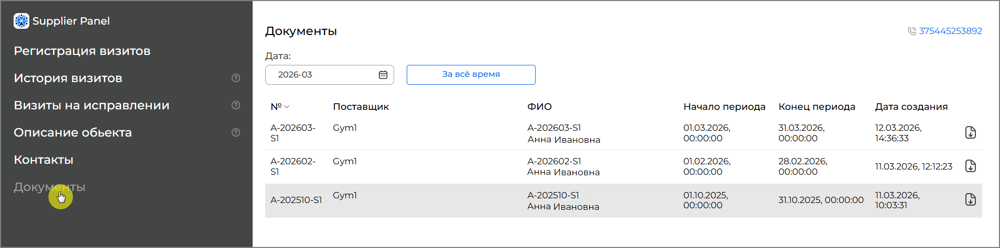

*Рис. 8 — Раздел «Документы» — список актов*

### 8.1. Список актов

Таблица документов содержит: номер акта, наименование поставщика, ФИО ответственного лица, начало и конец расчётного периода, дату создания. Для каждого акта доступна кнопка скачивания.

Для просмотра документов за конкретный период:

1. воспользуйтесь фильтром по дате — выберите нужный месяц в календаре;

2. нажмите «За всё время» для отображения всех документов без ограничения по дате.

### 8.2. Скачивание акта

Нажмите на значок скачивания в строке нужного акта. Документ будет загружен в формате PDF. Акт содержит:

1. реквизиты исполнителя (ваш объект) и заказчика (ООО «Оллспортс»);

2. таблицу оказанных услуг с указанием количества визитов и стоимости по каждой услуге;

3. итоговую сумму к оплате.

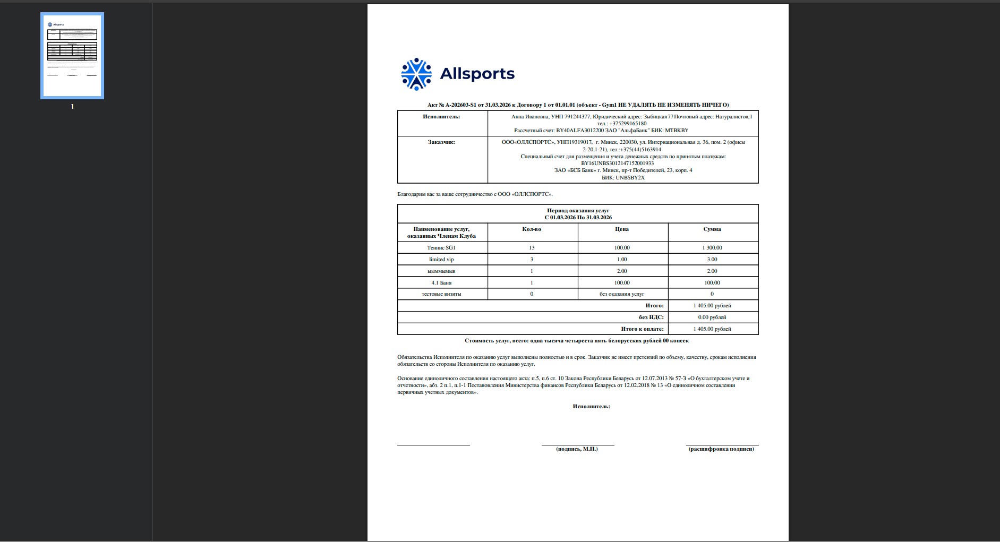

*Рис. 9 — Пример акта в формате PDF*

## 9. Техническая поддержка

Команда AllSports готова помочь с любым вопросом — от настройки панели до разбора конкретного визита. Мы работаем 7 дней в неделю, потому что ваш бизнес не останавливается в выходные.

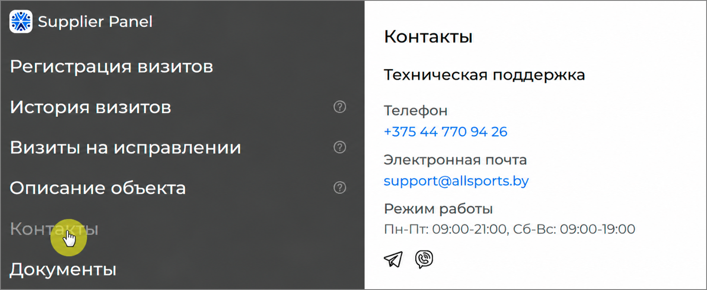

*Рис. 10 — Контакты технической поддержки*

Контакты технической поддержки:

1. Телефон: +375 44 770 94 26

2. Электронная почта: support@allsports.by

3. Режим работы: понедельник–пятница 09:00–21:00, суббота–воскресенье 09:00–19:00

4. Мессенджеры: Telegram, Viber

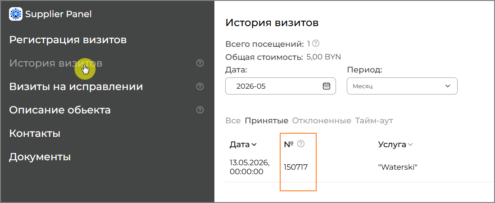

*Рис. 11 — Номер визита*
