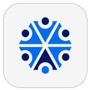
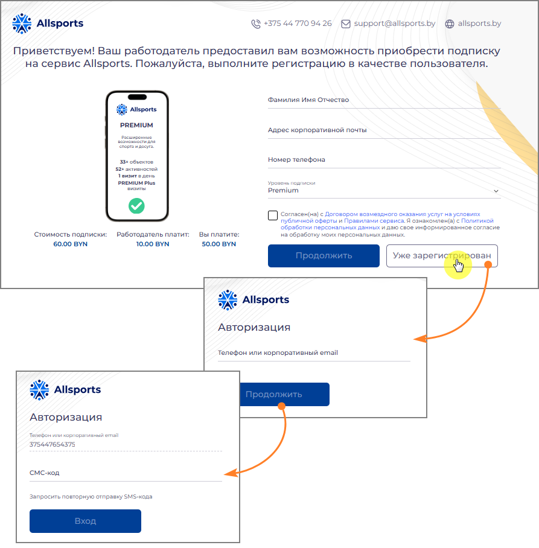
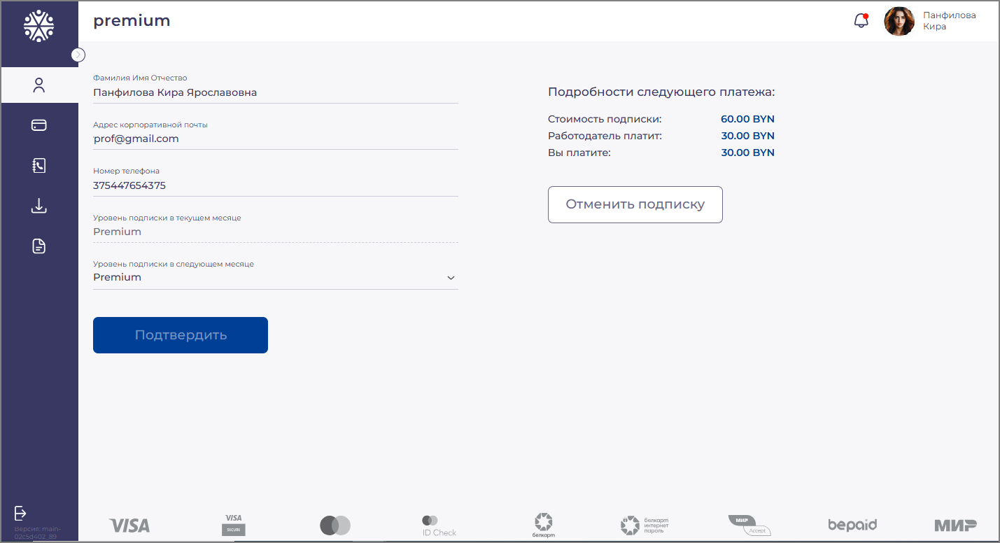
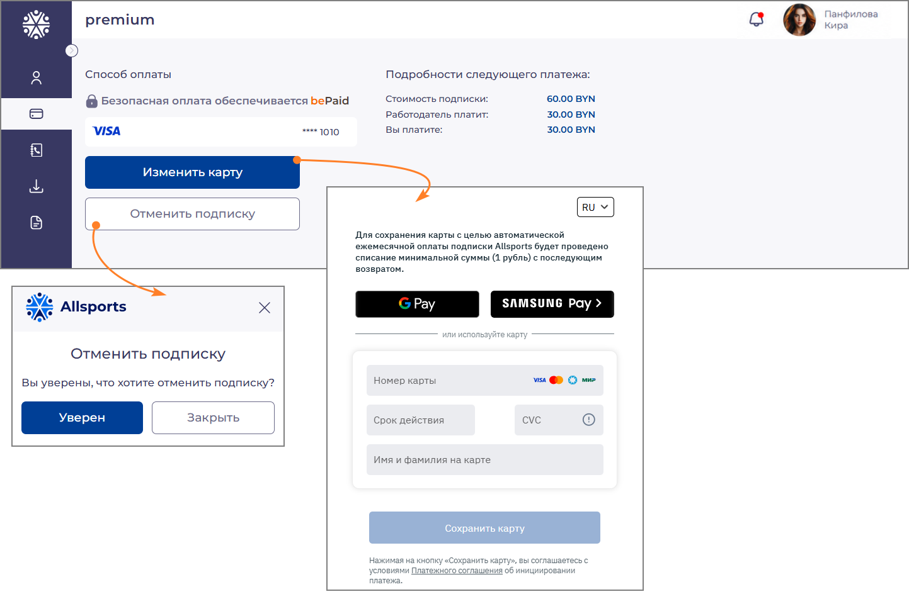
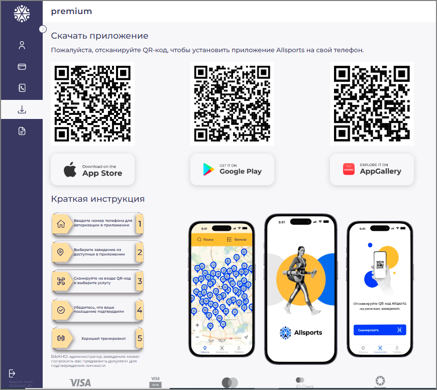
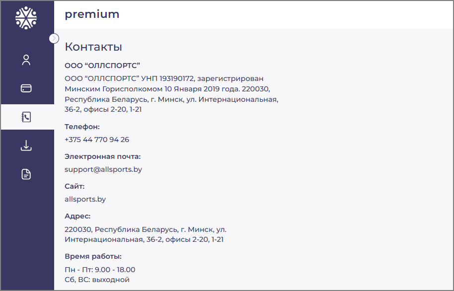
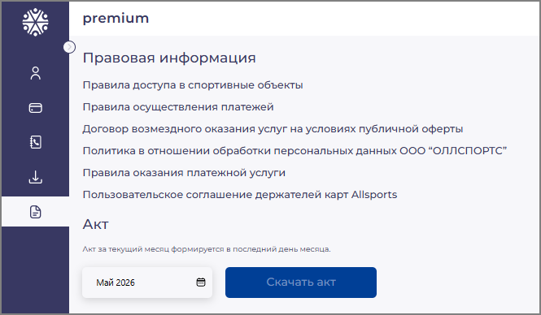

# Subscriber panel Allsports

[Скачать исходный DOCX](_assets/documents/user-panel.docx)

_Руководство пользователя_

## Содержание

## 1. О системе Allsports и Панели пользователя

Allsports — корпоративный спортивный абонемент, предоставляющий доступ к крупнейшей сети спортивных объектов Беларуси: 700+ объектов, 100+ видов активностей по всей стране — фитнес-клубы, бассейны, теннисные корты, единоборства, танцы, СПА и многое другое.

Панель пользователя — персональный веб-кабинет сотрудника, подключённого к сервису Allsports по модели Copay или B2C. Через него вы управляете своей подпиской: просматриваете данные профиля, выбираете уровень подписки на следующий месяц, меняете платёжную карту, скачиваете акты и получаете доступ к мобильному приложению.

Панель пользователя доступна по персональной ссылке, которую предоставляет HR-менеджер вашей компании.

| Функция | Описание |
| --- | --- |
| Профиль | Просмотр личных данных; выбор уровня подписки на следующий месяц |
| Способ оплаты | Просмотр и смена привязанной банковской карты |
| Скачать приложение | QR-коды для установки мобильного приложения Allsports |
| Контакты | Реквизиты и контактная информация ООО «ОЛЛСПОРТС» |
| Правовая информация | Правовые документы и скачивание акта за выбранный месяц |

## 2. Регистрация в Панели пользователя

Для получения доступа к Панели пользователя необходимо пройти первичную регистрацию по персональной ссылке, полученной от HR-менеджера вашей компании.

### 2.1. Переход по ссылке работодателя

Получите персональную ссылку от HR-менеджера (по электронной почте, в мессенджере или через корпоративный портал). Откройте ссылку в браузере — откроется страница регистрации с карточкой подписки.

*Рисунок 1 — Страница регистрации: форма ввода данных, информация о подписке*

На странице отображается карточка подписки с уровнем и ключевыми параметрами, а также информация о распределении стоимости:

1. «Стоимость подписки» — полная стоимость за месяц.

1. «Работодатель платит» — доля компании.

1. «Вы платите» — ваша доля (0,00 BYN, если компания покрывает стоимость полностью).

### 2.2. Заполнение формы регистрации

В правой части страницы заполните поля регистрационной формы:

1. Введите ваши полные ФИО в поле «Фамилия Имя Отчество».

1. Укажите рабочую электронную почту в поле «Адрес корпоративной почты». Ее можно использовать для авторизации в качестве логина.

1. Введите мобильный номер телефона в поле «Номер телефона» — его также можно использовать для авторизации в качестве логина.

1. Выберите уровень из выпадающего списка в поле «Уровень подписки» (если доступно несколько вариантов).

1. Ознакомьтесь с Договором возмездного оказания услуг и Политикой обработки персональных данных — проставьте отметку в чекбоксе согласия.

1. Нажмите кнопку Продолжить.

1. После этого система направит письмо на указанный email. Откройте письмо и перейдите по ссылке для подтверждения адреса электронной почты.

1. После подтверждения email ваша заявка поступает к HR-менеджеру компании на рассмотрение. Дождитесь одобрения.

> ⚠ Номер телефона вводится в международном формате без пробелов, плюса и иных символов — например: 375291234567. Это ваш логин в мобильном приложении и в Панели пользователя. Убедитесь в правильности номера перед отправкой формы.

> ℹ После одобрения заявки HR-менеджером доступ к мобильному приложению Allsports открывается немедленно — со следующего календарного месяца можно начать посещение спортивных объектов.

### 2.3. Вход для ранее зарегистрированных пользователей

Если у вас уже есть учётная запись, нажмите кнопку Уже зарегистрирован.

*Рисунок 2 — Вход для ранее зарегистрированных пользователей*

Откроется форма авторизации.

1. Введите номер телефона или email в поле «Телефон или корпоративный email».

1. Нажмите Продолжить.

1. Введите SMS-код, поступивший на указанный номер телефона или корпоративный e-mail.

1. Нажмите Вход.

Если SMS-код не пришёл в течение минуты — нажмите Запросить повторную отправку SMS-кода.

## 3. Навигация по Панели пользователя

После входа откроется интерфейс Панели пользователя. В левой части экрана расположена вертикальная панель навигации с иконками разделов. В верхней части страницы отображаются текущий уровень подписки и имя пользователя.

| Иконка | Раздел |
| --- | --- |
| Профиль (человек) | Просмотр профиля и управление подпиской |
| Карта | Способ оплаты |
| Контакты | Контактные данные |
| Стрелка вниз | Скачать приложение |
| Документ | Контакты |
| Файл с текстом | Правовая информация и акты |
| Профиль (человек) | Просмотр профиля и управление подпиской |

## 4. Раздел «Профиль»

Раздел «Профиль» открывается при нажатии иконки с силуэтом человека в боковом меню. Здесь отображаются персональные данные, текущий и будущий уровень подписки, а также информация о следующем платеже.

*Рисунок 3 — Раздел «Профиль»: персональные данные, уровень подписки и детали следующего платежа*

### 4.1. Персональные данные

В центральной части страницы отображаются следующие данные:

1. «Фамилия Имя Отчество» — ваше полное имя, указанное при регистрации.

1. «Адрес корпоративной почты» — email, привязанный к подписке.

1. «Номер телефона» — ваш логин в мобильном приложении Allsports.

1. «Уровень подписки в текущем месяце» — тип подписки, действующей в этом месяце. Поле доступно только для чтения.

1. «Уровень подписки в следующем месяце» — выпадающий список для выбора уровня на следующий расчётный период.

> ℹ Пользователь может самостоятельно внести изменения и отправить их на согласование HR. После одобрения запроса сотрудником HR изменения вступят в силу.

### 4.2. Детали следующего платежа

В правой части страницы отображается блок «Подробности следующего платежа»:

1. «Стоимость подписки» — полная стоимость выбранного уровня.

1. «Работодатель платит» — сумма, которую компания берёт на себя.

1. «Вы платите» — ваша доля, которая будет списана с привязанной карты. В модели B2C, если компания покрывает подписку полностью, значение равно 0,00 BYN.

> ℹ Суммы в блоке автоматически обновляются при смене уровня подписки на следующий месяц.

### 4.3. Изменение уровня подписки на следующий месяц

1. В поле «Уровень подписки в следующем месяце» нажмите на выпадающий список.

1. Выберите нужный уровень из доступных вариантов.

1. Проверьте данные в блоке «Подробности следующего платежа». После подтверждения запроса сотрудником HR в этом блоке отобразятся обновленные сведения.

1. Нажмите кнопку Подтвердить.

> ⚠ Изменение уровня подписки вступает в силу со следующего расчётного периода. Текущий месяц остаётся без изменений.

### 4.4. Отмена подписки

Для отмены подписки нажмите кнопку Отменить подписку в правой части страницы. Откроется диалоговое окно с запросом подтверждения.

1. Нажмите Уверен — для подтверждения отмены.

1. Нажмите Закрыть — для возврата к профилю без изменений.

> ⚠ Подписка отменяется немедленно. Доступ к мобильному приложению Allsports прекращается сразу после подтверждения отмены, не по окончании расчётного периода. Для возобновления обратитесь к HR-менеджеру.

> ℹ HR-менеджер компании также может отменить вашу подписку через Панель компании. В этом случае отмена вступает в силу с начала следующего расчетного периода, а доступ к мобильному приложению сохраняется до окончания текущего оплаченного периода.

## 5. Раздел «Способ оплаты»

Раздел «Способ оплаты» открывается при нажатии иконки банковской карты в боковом меню. Здесь вы управляете платёжной картой для автоматического ежемесячного списания вашей доли стоимости подписки.

*Рисунок 4 — Раздел «Способ оплаты»: текущая карта, форма добавления новой карты и диалог подтверждения отмены подписки*

### 5.1. Просмотр текущей карты

В разделе отображается информация о привязанной карте: логотип платёжной системы (Visa, Mastercard, Белкарт или МИР) и последние четыре цифры номера карты.

Безопасная обработка платежей обеспечивается системой bePaid. Полные карточные данные не хранятся на серверах Allsports.

### 5.2. Смена карты

Для привязки новой карты нажмите кнопку Изменить карту. Откроется защищённая форма ввода карточных данных.

1. Выберите способ оплаты: нажмите Google Pay или Samsung Pay — или введите данные карты вручную.

1. При ручном вводе заполните поля: «Номер карты», «Срок действия», «CVC», «Имя и фамилия на карте».

1. Нажмите кнопку Сохранить карту.

> ℹ При сохранении карты система проведёт тестовое списание минимальной суммы (1 рубль) с последующим возвратом для проверки карты.

> ⚠ Принимаются карты Visa, Mastercard, Белкарт и МИР. Вводите данные только на защищённой странице с адресом https://.

### 5.3. Отмена подписки

Отменить подписку также можно из раздела «Способ оплаты» — нажав кнопку Отменить подписку и подтвердив действие в появившемся диалоговом окне. Порядок отмены аналогичен описанному в разделе 4.4. Подписка отменяется немедленно.

## 6. Раздел «Скачать приложение»

Раздел открывается при нажатии иконки стрелки в боковом меню. Здесь находятся QR-коды для установки мобильного приложения Allsports на смартфон.

*Рисунок 5 — Раздел «Скачать приложение»: QR-коды для трёх платформ и краткая инструкция по использованию приложения*

### 6.1. Установка приложения

Приложение Allsports доступно для трёх платформ:

1. App Store (iOS) — для устройств iPhone и iPad.

1. Google Play (Android) — для большинства Android-смартфонов.

1. AppGallery (Huawei) — для устройств Huawei без сервисов Google.

Для установки:

1. Наведите камеру смартфона на QR-код нужной платформы.

1. Перейдите по появившейся ссылке — откроется страница приложения в магазине.

1. Нажмите Установить и дождитесь завершения загрузки.

1. Разрешите приложению доступ к геолокации — это необходимо для функции «Вход по локации».

> ℹ После установки войдите в приложение с помощью номера телефона, указанного при регистрации (в формате 375XXXXXXXXX, без пробелов и символов).

### 6.2. Краткая инструкция по оформлению визита

На странице также представлена пошаговая инструкция по оформлению визита через приложение:

1. Введите номер телефона для авторизации в приложении.

1. Выберите спортивный объект на карте.

1. Отсканируйте QR-код Allsports на стойке администратора объекта.

1. Покажите подтверждение визита на экране смартфона администратору.

1. Пройдите идентификацию — администратор сверит вашу фотографию в приложении.

## 7. Раздел «Контакты»

В разделе «Контакты» размещены официальные реквизиты и контактная информация ООО «ОЛЛСПОРТС».

*Рисунок 6 — Раздел «Контакты»: реквизиты и контактные данные ООО «ОЛЛСПОРТС»*

> ℹ По вопросам, связанным с вашей подпиской (изменение данных, смена номера телефона, активация доступа), обращайтесь в первую очередь к HR-менеджеру вашей компании.

## 8. Раздел «Правовая информация и акты»

Раздел открывается при нажатии иконки документа в нижней части бокового меню. Здесь размещены ссылки на правовые документы сервиса и функция скачивания акта.

*Рисунок 7 — Раздел «Правовая информация»: правовые документы и форма скачивания акта*

### 8.1. Правовая информация

В разделе доступны следующие документы:

1. «Правила доступа в спортивные объекты» — условия посещения партнёрских заведений.

1. «Правила осуществления платежей» — порядок и условия оплаты услуг.

1. «Договор возмездного оказания услуг на условиях публичной оферты» — основной договор между пользователем и ООО «ОЛЛСПОРТС».

1. «Политика в отношении обработки персональных данных ООО «ОЛЛСПОРТС»» — информация о защите ваших данных.

1. «Правила оказания платёжной услуги» — условия проведения платёжных операций.

1. «Пользовательское соглашение держателей карт Allsports» — соглашение для владельцев привязанных карт.

Нажмите на название нужного документа, чтобы открыть его в браузере. Документы доступны без авторизации.

> ℹ Состав документов может отличаться в зависимости от компании и условий подключения к сервису — например, для пользователей, подключённых через Приорбанк, отображается отдельный набор документов

### 8.2. Скачивание акта

В нижней части страницы расположена форма для получения акта об оказании услуг.

1. В поле выбора периода укажите нужный месяц и год (например, Май 2026).

1. Нажмите кнопку Скачать акт.

1. Файл акта будет загружен в формате PDF.

> ℹ Акт за текущий месяц формируется в последний день месяца. До этой даты кнопка «Скачать акт» недоступна.

> ⚠ Сохраняйте скачанные акты для целей бухгалтерского учёта. Повторно скачать акт можно в любой момент через Панель пользователя.

9. Техническая поддержка

Если у вас возникли трудности при использовании Панели пользователя или мобильного приложения, обратитесь в службу поддержки Allsports.

| Канал | Данные |
| --- | --- |
| Телефон | +375 44 770 94 26 |
| Электронная почта | support@allsports.by |
| Время работы | Пн–Пт: 9:00–18:00 |

При обращении рекомендуется указать:

1. Номер телефона, привязанный к учётной записи Allsports (в формате 375XXXXXXXXX).

1. Название компании-работодателя.

1. Краткое описание проблемы и действия, которые к ней привели.

Контактная информация

ООО «ОЛЛСПОРТС» | УНП 193190172

Республика Беларусь, 220030 г. Минск, ул. Интернациональная, 36-2, офисы 2-20, 1-21

Телефон: +375 44 770 94 26 | Email: support@allsports.by | Сайт: allsports.by
