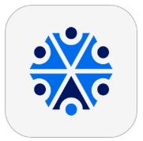
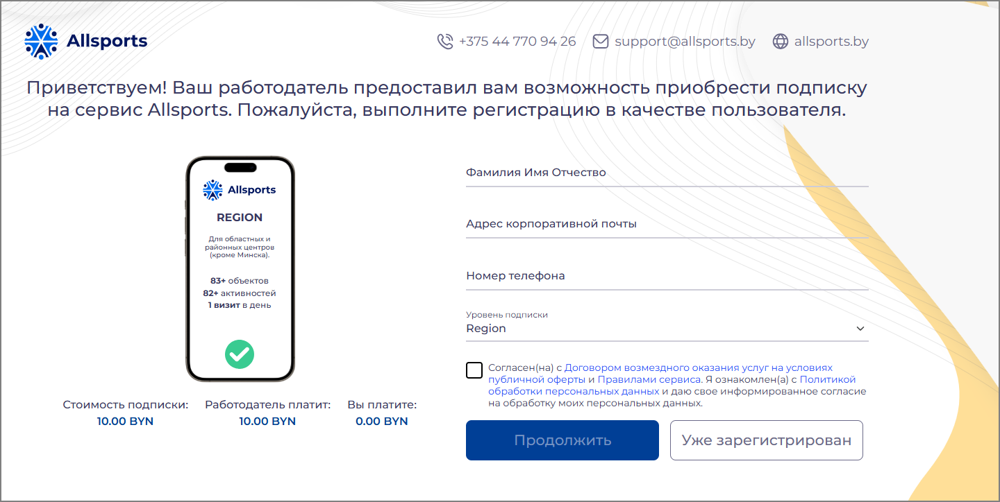
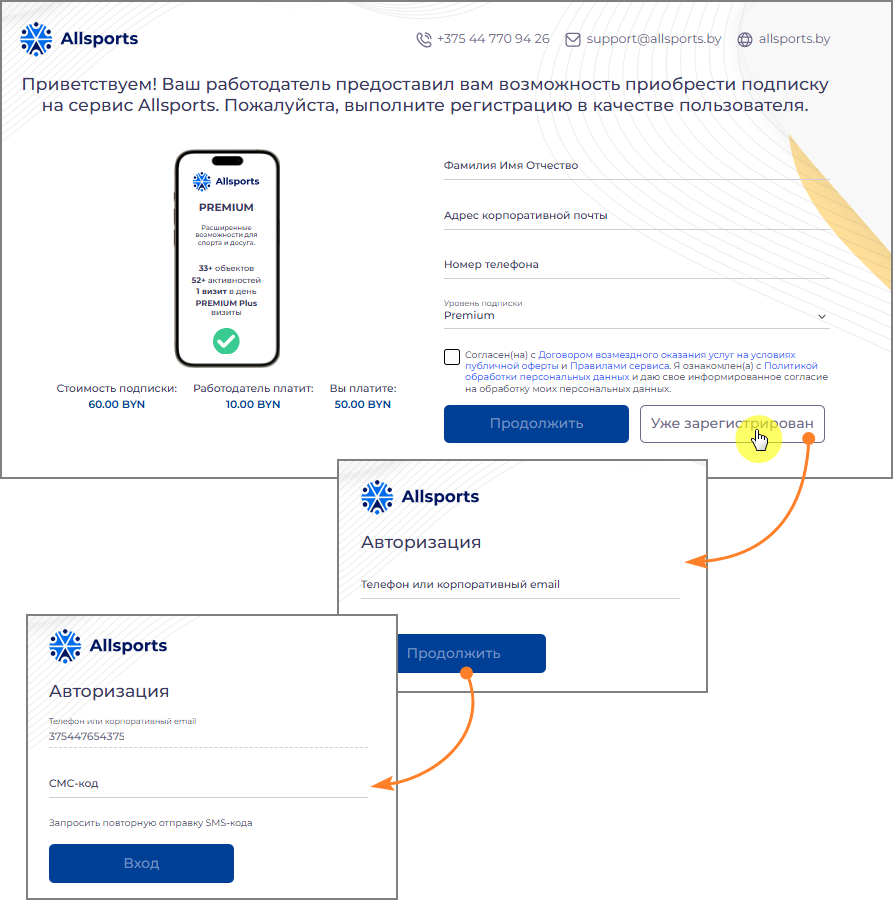
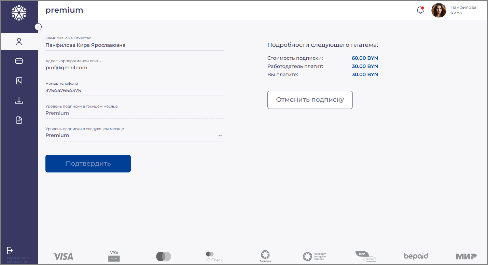
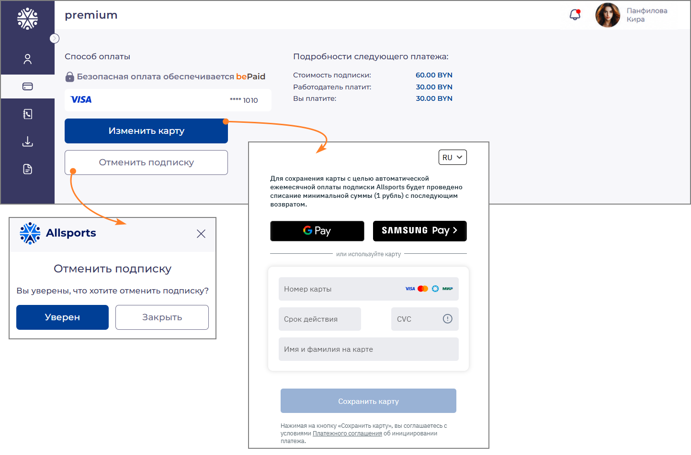
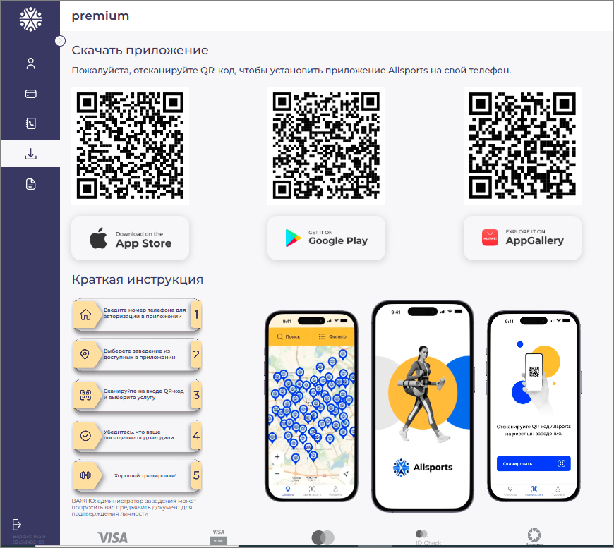
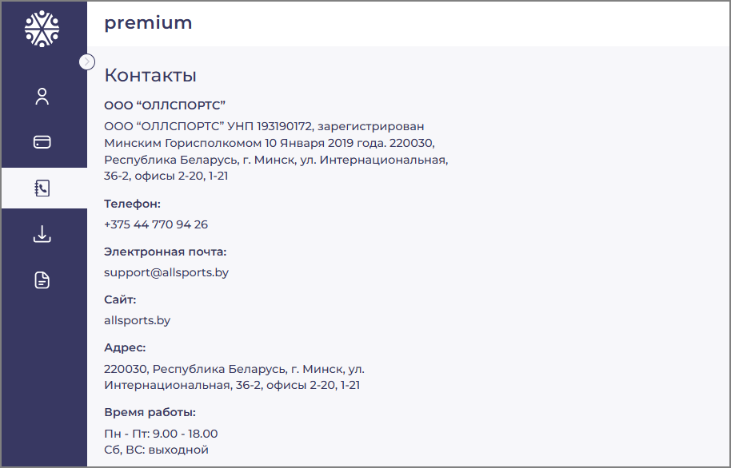
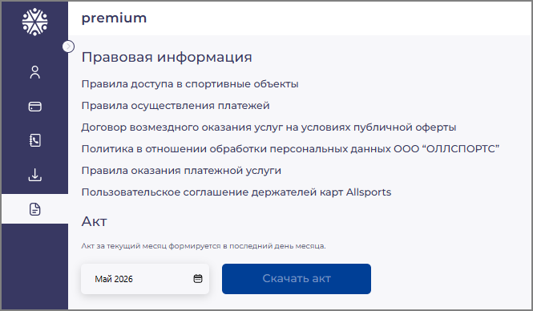

**ALLSPORTS**

**Панель пользователя**

Руководство пользователя

Минск,  2026

# О системе Allsports и Панели пользователя

## 1. О системе Allsports и Панели пользователя

Allsports — корпоративный спортивный абонемент, предоставляющий доступ к
крупнейшей сети спортивных объектов Беларуси: 700+ объектов, 100+ видов
активностей по всей стране — фитнес-клубы, бассейны, теннисные корты,
единоборства, танцы, СПА и многое другое.

Панель пользователя — персональный веб-кабинет сотрудника, подключённого
к сервису Allsports по модели Copay или B2C. Через него вы управляете
своей подпиской: просматриваете данные профиля, выбираете уровень
подписки на следующий месяц, меняете платёжную карту, скачиваете акты и
получаете доступ к мобильному приложению.

Панель пользователя доступна по персональной ссылке, которую
предоставляет HR-менеджер вашей компании.

| **Функция**         | **Описание**                                                     |
|---------------------|------------------------------------------------------------------|
| Профиль             | Просмотр личных данных; выбор уровня подписки на следующий месяц |
| Способ оплаты       | Просмотр и смена привязанной банковской карты                    |
| Скачать приложение  | QR-коды для установки мобильного приложения Allsports            |
| Контакты            | Реквизиты и контактная информация ООО «ОЛЛСПОРТС»                |
| Правовая информация | Правовые документы и скачивание акта за выбранный месяц          |

## 1.1. Уровни подписки

Каждому подписчику назначается один из уровней подписки. Уровень
определяет количество доступных спортивных объектов и видов активностей.
Конкретный набор уровней, доступных вашей компании, определяет
HR-менеджер при настройке сервиса.

| **Уровень** | **Описание**                                                                                            |
|-------------|---------------------------------------------------------------------------------------------------------|
| Start       | Базовый уровень: фитнес-клубы, бассейны, ключевые виды активностей                                      |
| Junior      | Расширенный набор объектов и активностей                                                                |
| Middle      | Средний уровень с широким покрытием объектов по всей стране                                             |
| Senior      | Высокий уровень: дополнительные виды активностей                                                        |
| Premium     | 700+ объектов, 110+ видов активностей: теннис, картинг, СПА. Включает 4 визита в объекты «Premium Plus» |

ℹ *Точное описание и стоимость каждого уровня отображаются на странице
регистрации и в разделе «Профиль». Уровень на текущий месяц изменить
нельзя — выбор действует со следующего расчётного периода.*

ℹ *В модели B2C, если компания покрывает стоимость подписки полностью,
поле «Вы платите» будет равно 0,00 BYN. Карту в таком случае привязывать
не обязательно.*

# 2. Регистрация в Панели пользователя

Для получения доступа к Панели пользователя необходимо пройти первичную
регистрацию по персональной ссылке, полученной от HR-менеджера вашей
компании.

## 2.1. Переход по ссылке работодателя

Получите персональную ссылку от HR-менеджера (по электронной почте, в
мессенджере или через корпоративный портал). Откройте ссылку в браузере
— откроется страница регистрации с карточкой подписки.

*Рисунок 1 — Страница регистрации: форма ввода данных, информация о
подписке*

На странице отображается карточка подписки с уровнем и ключевыми
параметрами, а также информация о распределении стоимости:

- «Стоимость подписки» — полная стоимость за месяц.

- «Работодатель платит» — доля компании.

- «Вы платите» — ваша доля (0,00 BYN, если компания покрывает стоимость
  полностью).

## 2.2. Заполнение формы регистрации

В правой части страницы заполните поля регистрационной формы:

1.  Введите ваши полные ФИО в поле «Фамилия Имя Отчество».

2.  Укажите рабочую электронную почту в поле «Адрес корпоративной
    почты».

3.  Введите мобильный номер телефона в поле «Номер телефона» — он станет
    вашим логином в системе.

4.  Выберите уровень из выпадающего списка в поле «Уровень подписки»
    (если доступно несколько вариантов).

5.  Ознакомьтесь с Договором возмездного оказания услуг и Политикой
    обработки персональных данных — проставьте отметку в чекбоксе
    согласия.

6.  Нажмите кнопку **Продолжить**.

7.  После этого система направит письмо на указанный email. Откройте
    письмо и перейдите по ссылке для подтверждения адреса электронной
    почты.

8.  После подтверждения email ваша заявка поступает к HR-менеджеру
    компании на рассмотрение. Дождитесь одобрения.

⚠ *Номер телефона вводится в международном формате без пробелов, плюса и
иных символов — например: 375291234567. Это ваш логин в мобильном
приложении и в Панели пользователя. Убедитесь в правильности номера
перед отправкой формы.*

ℹ *После одобрения заявки HR-менеджером доступ к мобильному приложению
Allsports открывается немедленно — можно сразу начать посещение
спортивных объектов.*

## 2.3. Вход для ранее зарегистрированных пользователей

Если у вас уже есть учётная запись, нажмите кнопку **Уже
зарегистрирован**.

*Рисунок 2 — Вход для ранее зарегистрированных пользователей*

Откроется форма авторизации.

1.  Введите номер телефона или email в поле «Телефон или корпоративный
    email».

2.  Нажмите **Продолжить**.

3.  Введите SMS-код, поступивший на указанный номер телефона.

4.  Нажмите **Вход**.

Если SMS-код не пришёл в течение минуты — нажмите **Запросить повторную
отправку SMS-кода**.

# 3. Навигация по Панели пользователя

После входа откроется интерфейс Панели пользователя. В левой части
экрана расположена вертикальная панель навигации с иконками разделов. В
верхней части страницы отображаются текущий уровень подписки и имя
пользователя.

| **Иконка**        | **Раздел**                              |
|-------------------|-----------------------------------------|
| Профиль (человек) | Просмотр профиля и управление подпиской |
| Карта             | Способ оплаты                           |
| Стрелка вниз      | Скачать приложение                      |
| Документ          | Контакты                                |
| Файл с текстом    | Правовая информация и акты              |

# 4. Раздел «Профиль»

Раздел «Профиль» открывается при нажатии иконки с силуэтом человека в
боковом меню. Здесь отображаются персональные данные, текущий и будущий
уровень подписки, а также информация о следующем платеже.

*Рисунок 3 — Раздел «Профиль»: персональные данные, уровень подписки и
детали следующего платежа*

## 4.1. Персональные данные

В центральной части страницы отображаются следующие данные:

- «Фамилия Имя Отчество» — ваше полное имя, указанное при регистрации.

- «Адрес корпоративной почты» — email, привязанный к подписке.

- «Номер телефона» — ваш логин в мобильном приложении Allsports.

- «Уровень подписки в текущем месяце» — тип подписки, действующей в этом
  месяце. Поле доступно только для чтения.

- «Уровень подписки в следующем месяце» — выпадающий список для выбора
  уровня на следующий расчётный период.

ℹ *Изменить номер телефона или email самостоятельно нельзя. При
необходимости обратитесь к HR-менеджеру вашей компании или в службу
поддержки Allsports.*

## 4.2. Детали следующего платежа

В правой части страницы отображается блок «Подробности следующего
платежа»:

- «Стоимость подписки» — полная стоимость выбранного уровня.

- «Работодатель платит» — сумма, которую компания берёт на себя.

- «Вы платите» — ваша доля, которая будет списана с привязанной карты. В
  модели B2C, если компания покрывает подписку полностью, значение равно
  0,00 BYN.

ℹ *Суммы в блоке автоматически обновляются при смене уровня подписки на
следующий месяц.*

## 4.3. Изменение уровня подписки на следующий месяц

5.  В поле «Уровень подписки в следующем месяце» нажмите на выпадающий
    список.

6.  Выберите нужный уровень из доступных вариантов.

7.  Проверьте обновившиеся данные в блоке «Подробности следующего
    платежа».

8.  Нажмите кнопку **Подтвердить**.

⚠ *Изменение уровня подписки вступает в силу со следующего расчётного
периода. Текущий месяц остаётся без изменений.*

## 4.4. Отмена подписки

Для отмены подписки нажмите кнопку **Отменить подписку** в правой части
страницы. Откроется диалоговое окно с запросом подтверждения.

- Нажмите **Уверен** — для подтверждения отмены.

- Нажмите **Закрыть** — для возврата к профилю без изменений.

⚠ *Подписка отменяется немедленно. Доступ к мобильному приложению
Allsports прекращается сразу после подтверждения отмены, не по окончании
расчётного периода. Для возобновления обратитесь к HR-менеджеру.*

ℹ *HR-менеджер компании также может отменить вашу подписку со своей
стороны через Панель компании. В этом случае доступ к приложению
прекращается так же немедленно.*

# 5. Раздел «Способ оплаты»

Раздел «Способ оплаты» открывается при нажатии иконки банковской карты в
боковом меню. Здесь вы управляете платёжной картой для автоматического
ежемесячного списания вашей доли стоимости подписки.

*Рисунок 4 — Раздел «Способ оплаты»: текущая карта, форма добавления
новой карты и диалог подтверждения отмены подписки*

## 5.1. Просмотр текущей карты

В разделе отображается информация о привязанной карте: логотип платёжной
системы (Visa, Mastercard, Белкарт или МИР) и последние четыре цифры
номера карты.

Безопасная обработка платежей обеспечивается системой bePaid. Полные
карточные данные не хранятся на серверах Allsports.

## 5.2. Смена карты

Для привязки новой карты нажмите кнопку **Изменить карту**. Откроется
защищённая форма ввода карточных данных.

1.  Выберите способ оплаты: нажмите **Google Pay** или **Samsung Pay** —
    или введите данные карты вручную.

2.  При ручном вводе заполните поля: «Номер карты», «Срок действия»,
    «CVC», «Имя и фамилия на карте».

3.  Нажмите кнопку **Сохранить карту**.

ℹ *При сохранении карты система проведёт тестовое списание минимальной
суммы (1 рубль) с последующим возвратом для проверки карты.*

⚠ *Принимаются карты Visa, Mastercard, Белкарт и МИР. Вводите данные
только на защищённой странице с адресом https://.*

## 5.3. Отмена подписки

Отменить подписку также можно из раздела «Способ оплаты» — нажав кнопку
**Отменить подписку** и подтвердив действие в появившемся диалоговом
окне. Порядок отмены аналогичен описанному в разделе 4.4. Подписка
отменяется немедленно.

**6. Раздел
«Скачать приложение»**

Раздел открывается при нажатии иконки стрелки в боковом меню. Здесь
находятся QR-коды для установки мобильного приложения Allsports на
смартфон.

*Рисунок 5 — Раздел «Скачать приложение»: QR-коды для трёх платформ и
краткая инструкция по использованию приложения*

## 6.1. Установка приложения

Приложение Allsports доступно для трёх платформ:

- App Store (iOS) — для устройств iPhone и iPad.

- Google Play (Android) — для большинства Android-смартфонов.

- AppGallery (Huawei) — для устройств Huawei без сервисов Google.

Для установки:

1.  Наведите камеру смартфона на QR-код нужной платформы.

2.  Перейдите по появившейся ссылке — откроется страница приложения в
    магазине.

3.  Нажмите **Установить** и дождитесь завершения загрузки.

4.  Разрешите приложению доступ к геолокации — это необходимо для
    функции «Вход по локации».

ℹ *После установки войдите в приложение с помощью номера телефона,
указанного при регистрации (в формате 375XXXXXXXXX, без пробелов и
символов).*

## 6.2. Краткая инструкция по оформлению визита

На странице также представлена пошаговая инструкция по оформлению визита
через приложение:

1.  Введите номер телефона для авторизации в приложении.

2.  Выберите спортивный объект на карте.

3.  Отсканируйте QR-код Allsports на стойке администратора объекта.

4.  Покажите подтверждение визита на экране смартфона администратору.

5.  Пройдите идентификацию — администратор сверит вашу фотографию в
    приложении.

**7. Раздел «Контакты»**

В разделе «Контакты» размещены официальные реквизиты и контактная
информация ООО «ОЛЛСПОРТС».

*Рисунок 6 — Раздел «Контакты»: реквизиты и контактные данные ООО
«ОЛЛСПОРТС»*

ℹ *По вопросам, связанным с вашей подпиской (изменение данных, смена
номера телефона, активация доступа), обращайтесь в первую очередь к
HR-менеджеру вашей компании.*

# 8. Раздел «Правовая информация и акты»

Раздел открывается при нажатии иконки документа в нижней части бокового
меню. Здесь размещены ссылки на правовые документы сервиса и функция
скачивания акта.

*Рисунок 7 — Раздел «Правовая информация»: правовые документы и форма
скачивания акта*

## 8.1. Правовая информация

В разделе доступны следующие документы:

- «Правила доступа в спортивные объекты» — условия посещения партнёрских
  заведений.

- «Правила осуществления платежей» — порядок и условия оплаты услуг.

- «Договор возмездного оказания услуг на условиях публичной оферты» —
  основной договор между пользователем и ООО «ОЛЛСПОРТС».

- «Политика в отношении обработки персональных данных ООО «ОЛЛСПОРТС»» —
  информация о защите ваших данных.

- «Правила оказания платёжной услуги» — условия проведения платёжных
  операций.

- «Пользовательское соглашение держателей карт Allsports» — соглашение
  для владельцев привязанных карт.

Нажмите на название нужного документа, чтобы открыть его в браузере.
Документы доступны без авторизации.

## 8.2. Скачивание акта

В нижней части страницы расположена форма для получения акта об оказании
услуг.

1.  В поле выбора периода укажите нужный месяц и год (например, Май
    2026).

2.  Нажмите кнопку **Скачать акт**.

3.  Файл акта будет загружен в формате PDF.

ℹ *Акт за текущий месяц формируется в последний день месяца. До этой
даты кнопка «Скачать акт» недоступна.*

⚠ *Сохраняйте скачанные акты для целей бухгалтерского учёта. Повторно
скачать акт можно в любой момент через Панель пользователя.*

**9.
Техническая поддержка**

Если у вас возникли трудности при использовании Панели пользователя или
мобильного приложения, обратитесь в службу поддержки Allsports.

| **Канал**         | **Данные**           |
|-------------------|----------------------|
| Телефон           | +375 44 770 94 26    |
| Электронная почта | support@allsports.by |
| Время работы      | Пн–Пт: 9:00–18:00    |

При обращении рекомендуется указать:

- Номер телефона, привязанный к учётной записи Allsports (в формате
  375XXXXXXXXX).

- Название компании-работодателя.

- Краткое описание проблемы и действия, которые к ней привели.

**Контактная информация**

ООО «ОЛЛСПОРТС» \| УНП 193190172

Республика Беларусь, 220030 г. Минск, ул. Интернациональная, 36-2, офисы
2-20, 1-21

Телефон: +375 44 770 94 26 \| Email: support@allsports.by \| Сайт:
allsports.by
